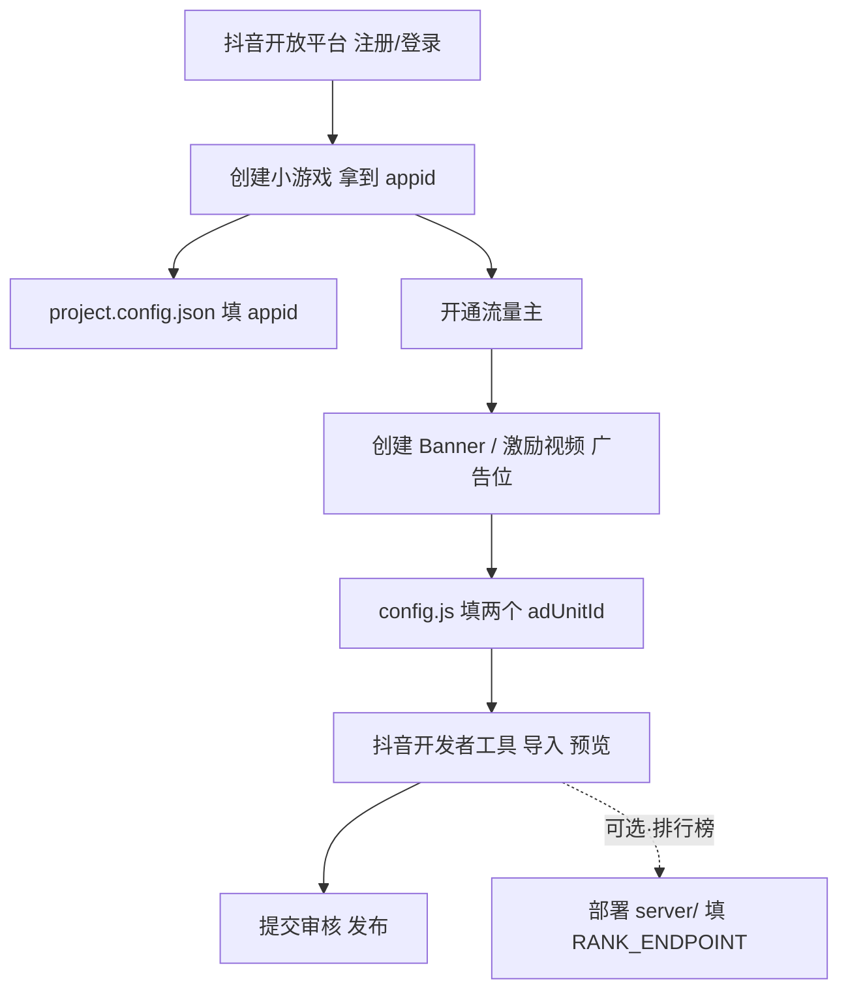

# 合成能量（Merge Energy）—— 抖音小游戏 MVP

一款 2048 式「合成」休闲小游戏。纯 Canvas 渲染、无外部素材，规避版权风险；
广告位以占位形式接入，上线前填入真实 `adUnitId` 即可变现。

## 玩法
- 上下左右滑动屏幕，相同数字方块合并成更大数字。
- 每次移动后随机生成一个新方块（2 或 4）。
- 棋盘填满且无可合并时游戏结束；点击屏幕看广告重开。

## 目录结构
```
douyin-merge-game/
├── game.js              # 抖音小游戏入口：渲染 / 触摸输入 / 广告位 / 排行榜（云后端）
├── game.json           # 小游戏运行时配置
├── project.config.json # 开发者工具工程配置（含 appid）
├── config.js           # 上线前运行时配置：广告位 + 排行榜后端地址 + 签名密钥
├── src/
│   ├── logic.js        #   纯逻辑（合成/计分/判负），可在 Node 单测
│   └── hmac.js         #   纯 JS HMAC-SHA256（前端给上报分数签名，防刷分）
├── server/             # 排行榜云后端（零依赖 Node 服务，可部署到 Vercel / Cloudflare）
│   ├── store.js        #   可插拔存储：memory / file(持久化) / upstash(Redis)
│   ├── index.js        #   Vercel / 通用 Node HTTP 服务（含 HMAC 验签）
│   ├── worker.js       #   Cloudflare Workers 入口
│   ├── vercel.json     #   Vercel 部署配置
│   └── README.md       #   部署与接口说明
├── test/
│   ├── logic.test.js   #   逻辑单元测试
│   ├── hmac.test.js    #   HMAC 与 Node crypto 一致性
│   ├── server.test.js  #   三后端存储单测（含 file 持久化）
│   ├── server-http.test.js # 真实 HTTP 防刷分测试（签名/时效/范围）
│   ├── game-rank.test.js #   前端排行榜联调（滑动/请求/签名）
│   └── vibrate-toggle.test.js # 震动开关测试
└── README.md
```

## 排行榜说明（自建云后端 · 全球榜）
- 游戏进行中右上角有「排行榜」按钮，点开是全屏榜单窗口。
- **只显示前 100 名**（用户名 + 分数 + 名次）；百名之后的其他玩家不展示。
- 若你自己排在 100 名之外，榜单底部固定条仍显示「你的排名：第 N 位」+ 你的最高分。
- **数据来源**：自建云后端（`server/`），所有玩家分数真实汇总，是真·全球榜（非本地假数据）。
  - 打开榜单时先上传当前分数（`POST /api/score`），再拉取榜单（`GET /api/rank`）。
  - **防刷分**：每次上报/查榜都带 `HMAC-SHA256(密钥, 载荷)` 签名（`ts` 时间戳防重放，分数范围校验）；后端验签失败直接拒绝。
  - **持久化存储**：后端可选 `memory` / `file`(JSON 落盘) / `upstash`(Redis REST)，按 `RANK_STORE` 环境变量切换，无需改前端。
  - 加载中显示「榜单加载中…」；失败显示错误并可「点击任意处重试」。
- **首次进入**会自动在本机生成随机昵称 + 唯一 id（存 `tt.setStorageSync`），用于在全球榜标识你。
- 部署、签名密钥、存储后端的配置详见 `server/README.md`；后端地址与密钥填入 `config.js` 的 `RANK_ENDPOINT` / `RANK_SECRET`。

## 本地无法运行说明
抖音小游戏运行在「抖音开发者工具」专属运行时（`tt.*` API + Canvas），
**不能**在普通浏览器或 Node 中直接跑画面。但核心逻辑可独立测试：
```bash
node test/logic.test.js
```

## 配置速查（上线前只需改两处）
- **① `project.config.json`** → 把 `"appid": "touristappid"` 改成你的真实小游戏 appid（抖音开发者工具读取，用于导入工程）。
- **② `config.js`** → 填 `BANNER_AD_ID`（Banner 广告位 ID）与 `REWARD_AD_ID`（激励视频广告位 ID），均在「开放平台 → 小游戏 → 流量主」后台创建后获得。这是上线前**唯一要改的运行时文件**（若不接广告留空也不影响游戏）。
- **③ `config.js` 的 `RANK_ENDPOINT` + `RANK_SECRET`**（可选）→ 排行榜云后端地址与签名密钥。**只有想开启全球排行榜才需要**：部署 `server/` 后填入 `RANK_ENDPOINT`（如 `https://xxx.vercel.app/api`）；`RANK_SECRET` 必须与后端环境变量 `RANK_SECRET` **完全一致**（建议用长随机串），否则后端会拒绝上报。留空则排行榜按钮提示「未配置」（不上传签名，仅本地联调用）。本地调试可填 `http://localhost:3000/api`，并在抖音开发者工具勾选「不校验合法域名」。



## 上架步骤
1. **注册账号**：打开 [抖音开放平台](https://open.douyin.com/) → 进入「小游戏」→ 注册（个人/企业均可，变现建议用企业实名）。
2. **创建小游戏**：在控制台创建小游戏，获取 `appid`。
3. **填入 appid**：把 `project.config.json` 里的 `"appid": "touristappid"` 改成你的真实 appid。
4. **导入工程**：下载「抖音开发者工具」→ 导入本目录 → 预览（可用游客/tourist 模式先试玩）。
5. **接广告**：控制台开通「流量主」→ 创建 Banner 广告位与激励视频广告位 → 把对应 `adUnitId` 填到 `config.js` 的 `BANNER_AD_ID` / `REWARD_AD_ID`（上线前唯一要改的运行时文件）。
6. **提交审核**：填写名称/类目/软著或资质（休闲类通常较宽松）→ 提交 → 审核通过后发布。

## 变现说明
- **Banner 广告**：游戏结束时展示（`showBanner()`）。
- **激励视频**：结束点击后看广告重开（`watchRewardedThenRestart()`），eCPM 通常高于 Banner。
- 收益 = 真实曝光/点击 × 平台单价，前提是**有人玩、玩得久**。所以玩法趣味性和留存是变现前提。

## 合规提醒（很重要）
- 素材全部用代码绘制，不引用任何第三方图片/音乐，避免侵权。
- 不出现低俗、诱导（如「包赚」「一刀999」）、虚假宣传话术。
- 类目与资质按平台最新要求准备，审核红线优先于单条收益。

## 后续可扩展
- 增加「最高分本地存储」（`tt.setStorageSync`）。
- 换皮主题（消除/合成不同题材）批量做号矩阵。
- 接入埋点，分析关卡流失，优化留存。
