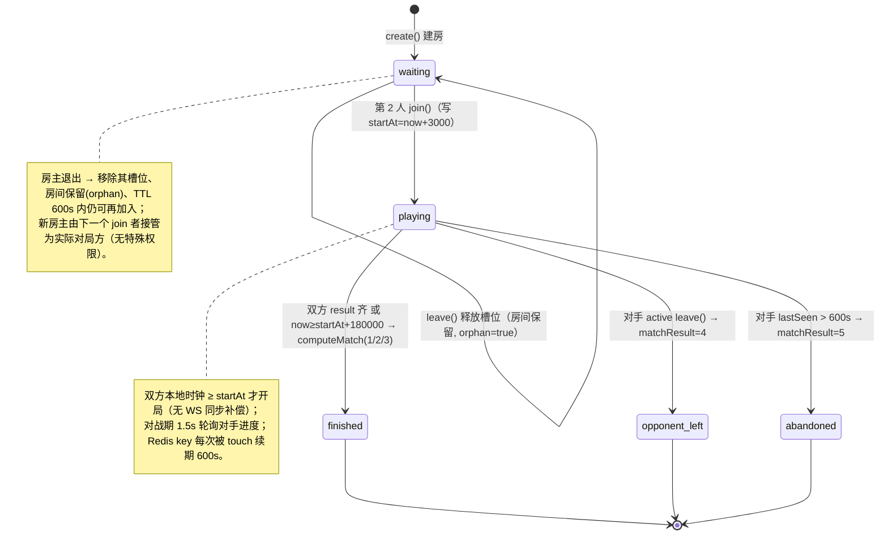
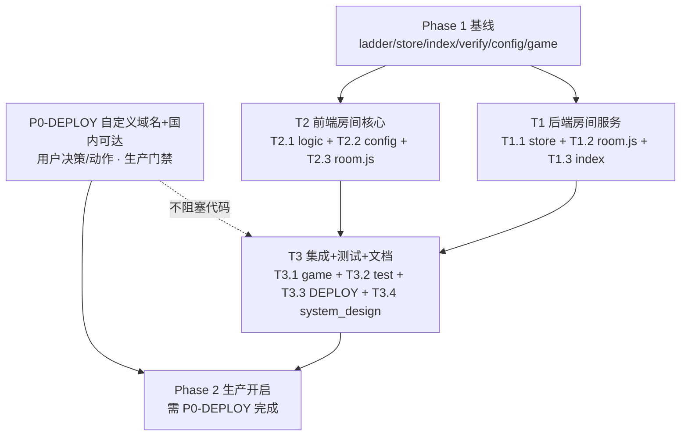

# 合成能量 · Phase 2 实时房间对战 — 设计锁定文档（Design Lock）

> 作者：高见远（架构师） · 文档类型：**设计锁定 + 最终任务清单**（交付工程师）
> 输入：`docs/phase2-prd.md`（增量 PRD）、`docs/phase2-plan.md`（已批准架构计划）、`docs/system_design.md`（Phase 1 已上线总设计）
> 状态：⚠️ **本文件为 Phase 2 的权威设计基线，工程师据此实现，不再二次设计。**
> 约束基线（不可违背）：纯 Canvas 渲染、零 npm 依赖、原生 `tt.*` API；复用同一 Upstash 实例与同一 Vercel 项目；不引入新托管平台/新依赖；HMAC 签名协议不变（复用 `RANK_SECRET`）。

---

## 0. 文档定位与已确认前提

- Phase 1（异步天梯）已上线，后端 `server/index.js` / `store.js` / `ladder.js` / `verify.js`、前端 `config.js` / `src/logic.js` / `src/ladder.js` / `game.js` / `src/hmac.js` 结构稳定，Phase 2 全部在其上增量扩展。
- 用户已确认采用 `phase2-plan.md §9` 推荐默认值并**关闭 §9 待拍板项**（不开放讨论）：
  - 房间人数 = **2**
  - 胜负规则 = **先合成 2048 者胜；或 180s 到点比分(分数)高者胜；平分 = 平局**
  - 轮询间隔 = **1500ms**
  - 房间 TTL = **600s**（TTL 内可重连）
  - 同步缓冲 = **3000ms**（第 2 人加入时 `startAt = now + 3000`）
- 本文件第 3 节逐条落实 PRD 第 6 节「7 项待确认问题」，给出可实现的**最终决策**，不留开放项。

---

## 1. 锁定的全部常量取值表（工程师可直接抄进代码）

> 下列常量由工程师落盘到指定文件。服务端常量放 `server/room.js` 顶部；客户端常量放 `config.js` 顶部（供 `src/room.js` 读）。两端含义一致。

### 1.1 服务端常量（建议放 `server/room.js`）

```js
// server/room.js —— Phase 2 房间服务常量（锁定值）
const ROOM_PLAYERS        = 2;        // 房间固定 2 人
const ROOM_TTL_SECONDS    = 600;      // Redis key EXPIRE（重连窗口，对应 AC-7/AC-8）
const ROOM_CODE_LEN       = 6;        // 房码长度（固定 6 位）
const ROOM_CODE_CHARS     = 'ABCDEFGHIJKLMNOPQRSTUVWXYZ0123456789'; // 仅大写字母 + 数字
const ROOM_CODE_REGEX     = /^[A-Z0-9]{6}$/; // 加入时校验房码格式
const SYNC_BUFFER_MS      = 3000;     // 第 2 人加入: startAt = Date.now() + 3000
const MATCH_DURATION_MS   = 180000;   // 180s 到点判定边界 = startAt + 180000
const STALE_ABANDON_MS    = 600000;   // 对手 lastSeen 超过此值(>TTL) → abandoned（= ROOM_TTL_SECONDS*1000）
const PROGRESS_THROTTLE_MS= 500;      // progress 节流下限（或每步取先到者）
const SEED_MAX            = 0x7FFFFFFF; // makeSeed() 取值范围 [0, SEED_MAX]
// 以下三项直接复用 index.js 既有环境变量，不新增：
//   SIGN_TTL（默认 300s，秒级）、RANK_MAX_SCORE（默认 1e7）、RANK_SECRET
```

### 1.2 客户端常量（建议放 `config.js` 顶部）

```js
// config.js —— Phase 2 房间前端常量（锁定值）
const ROOM_POLL_MS         = 1500;   // 对战期轮询间隔
const ROOM_WAIT_POLL_MS    = 1000;   // waiting 期房主轮询降频（仅等对手）
const ROOM_TIMEOUT_RACE_MS = 3500;   // Promise.race 超时兜底（抖音 tt.request 无原生 timeout）
const ROOM_BACKOFF_MS      = [1500, 3000, 4500, 6000]; // 失败指数退避序列，上限 6000
const ROOM_BACKOFF_MAX_MS  = 6000;   // 退避上限
const ROOM_PROGRESS_THROTTLE_MS = 500; // 与 PROGRESS_THROTTLE_MS 一致
```

### 1.3 枚举锁定

**`status`（房间状态）**

| 值 | 含义 | 进入条件 |
|----|------|----------|
| `waiting` | 0~1 人，等待对手 | `create` 后；或 `leave` 释放槽位后 |
| `playing` | 2 人，对局中 | 第 2 人 `join` 成功（写 `startAt=now+3000`） |
| `finished` | 正常终局 | 双方 `result` 齐 **或** `now ≥ startAt+180000` → `computeMatch` 写 `matchResult∈{1,2,3}` |
| `opponent_left` | 对手主动退出 | 对手 `leave`（`status=playing`）→ `matchResult=4` |
| `abandoned` | 对手断线超 TTL | 对手 `lastSeen` 陈旧 > `STALE_ABANDON_MS`（`status=playing`）→ `matchResult=5` |

**`matchResult`（终局判定结果，服务端权威写入）**

| 值 | 含义 | 触发 |
|----|------|------|
| `0` | 未定（unset） | 对局进行中 |
| `1` | P1 胜 | 任一方先到 2048（`won=true`）→ 该方胜；或 180s 到点 P1 分高 |
| `2` | P2 胜 | 同上，P2 视角 |
| `3` | 平局（draw） | 180s 到点双方分数相等 |
| `4` | 对手主动退出（我方胜） | 对手 `leave`，`status=opponent_left` |
| `5` | 对手断线超 TTL（我方胜） | 对手 `lastSeen>600s`，`status=abandoned` |

> 前端结算卡文案映射：`1/2` → 「你胜利！」（按自身 uid 判断是 P1 还是 P2）；`3` → 「平局」；`4/5` → 「对手已离开 / 你赢了」。所有文案复用色板 `#edc22e`(金) / `#5b4a1f`(深棕)，详见 §4 / T2 / T3。

---

## 2. 房间状态机（含转移条件与 TTL 作用）



### 2.1 TTL 双重语义（必须区分）

| 机制 | 触发 | 作用 | 失败表现 |
|------|------|------|----------|
| **Redis key `EXPIRE 600s`** | 房间创建/每次被 `roomTouch` 重置 | 整个房间的「重连窗口」 | 双方均断线或窗口内无人 touch → key 消失 → 重连返回 `code=3`（AC-8「房间不存在」） |
| **per-player `lastSeen`（updatedAt）** | 该玩家每次 `progress`/`state`/`join` 刷新 | 对局中断线判定 | 对局中一方 `lastSeen` 陈旧 > 600s → 在场方轮询判定 `abandoned`（matchResult=5） |

> 关键：对局中若一方断线但另一方仍在轮询，在场方会持续 `roomTouch` 续期 key，房间不会因 key 过期消失；对局终止与否由 **per-player lastSeen** 决定，而非 key TTL。两者都用 600s，但语义不同，严禁混用。

---

## 3. 7 项待确认问题的最终决策（逐一落实，无开放项）

### Q1 双满格不同步到达的胜负判定
**决策**：约定「任一方满格(over)即视为该方终局，立即 `submitResult`（此方状态=over）；当双方都已提交 `result`（含 over 态）或 180s 到点，服务端计算最终胜负」。即**满格 = 隐式提交终局**，不要求先到 2048。
- 客户端在 `Logic.move` 返回 `state.over===true`（棋盘满格且无可合并）时，**自动**调用 `POST /api/room/result {won:false}`（满格不代表赢，只代表自己终局）。
- 服务端：任一方 `over` 提交后，若该方 `maxTile<2048` 且 `won=false`，则仅记录其 `results`；当**双方 results 齐**（或 180s 到点）才 `computeMatch`。
- `computeMatch`：任一方 `won=true`（先到 2048）→ 该方胜；否则到点比分高者胜；平分 → `3`。

### Q2 180s 到点瞬间分数相等的边界
**决策**：以服务端在边界对 `store` 中双方**最新 progress** 的快照为准，快照时刻 = `startAt + 180000ms`；该时刻**前的最后一手计入，边界后不计**。客户端**也以同一边界**（`Date.now() >= startAt + 180000`）判定，避免分歧。
- 服务端 `getState` 在 `now >= startAt + MATCH_DURATION_MS` 时触发 `computeMatch(timeout)`：直接读 `room.players[p1].score` / `room.players[p2].score`（均已被 progress 单调更新为最新一手），比较高下。
- `progress` 上报的是节流窗末态（最新一步后）的 `score/steps/over`，服务端存储即「最后一手快照」，无需额外快照逻辑。

### Q3 房主角色缺失 + 降级状态机
**决策**：Phase 2 **不引入房主概念**，房间为「先创建者 = 房主，但无特殊权限」。明确降级规则：
- **waiting 期创建者退出**（主动 `leave` 或断线）：服务端**移除其玩家槽位**、房间在 TTL 内保留并标记 `orphan=true`；第 2 人（任一携码者）`join` 时仍可成局，接管为实际对局方（清空 orphan 标记）。房间仍需凑满 2 人才 `playing`。
- **playing 期任一方断线超 TTL**（未在 TTL 内重连、`lastSeen>600s`）：房间整体失效，`matchResult=5`(abandoned)，在场方结算卡显示「对手已离开」。
- **主动离开（非断网）**：见 Q6，走 `leave` 接口 → `matchResult=4`(opponent_left)。

### Q4 progress 节流与 boardSummary 语义
**决策**：约定「progress 上报节流 ≥500ms 或每步（取先到者）；上报的是节流窗末态（最新一步后）的 `score/steps/over`，**仅用于展示层，不回放棋局**」。
- `boardSummary` 在房间场景**仅含三个标量 `{score, steps, over}`**（即直接以顶层字段 `score` / `steps` / `over` 上报与下发），**不传 16 格棋盘**（与天梯 `boardSummary` 的 16 格字符串含义不同，本 MVP 房间不使用 16 格摘要）。
- 客户端 `src/room.js` 节流：维护 `lastProgressAt`，当 `Date.now()-lastProgressAt ≥ 500` **或** 本步已落子时上报，取先到者；上报内容为最新一步后的 `{score, steps, over}`。

### Q5 再来一局策略
**决策**：约定「复用同一 `room code`（TTL 内），对局结束后任一方点再来一局 → 服务端 `reset` 房间（**新 seed**、状态回 `waiting`、清空双方 `progress`/`results`）→ 双方重新同步开局」。
- 新增内部方法 `RoomService.reset(code)`：仅当 `matchResult∈{1,2,3,4,5}`（已终局）允许；生成新 `seed`、清空 `players` 进度、`results={}`、`matchResult=0`、`status=waiting`、`startAt=null`，`EXPIRE` 续 600s。
- 不新建房间、不重新分享房码；客户端「再来一局」按钮调用 `POST /api/room/reset`（或复用 `create` 带 `code` 参数，由工程师二选一，推荐新增 `reset` 语义清晰），成功后双方回到 waiting/重开流程。
- **注意**：再来一局需双方都点「再来一局」才真正重开（避免单方重置影响对方）。实现上：`reset` 由先点击方触发 `status=waiting`；对方轮询 `state` 读到此态即回到等待/重开 UI。

### Q6 对手在 TTL 内主动退出（非断网）
**决策**：约定「主动退出 = 客户端发 `POST /api/room/leave`（或置 `state='left'`）；服务端将其记为 `left`，对方轮询 `state` 时 `matchResult` 返回 `opponent_left(4)`，结算卡显示「对手已离开 / 你赢了」并允许返回」。
- 新增接口 `POST /api/room/leave {code,uid,ts,sig}`（决策点：采用**专用 leave 接口**，语义清晰，优于复用 result 带 reason）。
- `leave` 行为分支：
  - `status=waiting`：移除该玩家槽位（房间保留 orphan），不判终局。
  - `status=playing`：标记 `players[uid].left=true`，写 `matchResult=4`、`status=opponent_left`。
- 对手下一次 `GET /api/room/state` 读到 `matchResult=4` → 结算卡「对手已离开 / 你赢了」+ 可返回。

### Q7 HUD 缩略棋盘
**决策**：约定「MVP **不渲染**对手缩略棋盘，HUD 仅显示对手分数 + 步数小字 + 底部比分条」。缩略棋盘解码规范本期**不做（P2）**。
- `state` 轮询返回的 `opponent` 仅含 `{score, steps, over, updatedAt}` 标量。
- HUD 布局（见 PRD §5.4）：右上小字「对手: P2  1820 · 64步」；底部状态条「我: 2048 · 120步  同步中…」；比分条「比分 2048 vs 1820」。

---

## 4. 后端接口契约定稿（6 接口，含新增 leave）

> 全部挂在 `RANK_ENDPOINT` 的 `/room/*` 下（与天梯共用域名，换可达域名只改 `config.js` 一处）。
> 统一信封：`{ code, data, message }`；`code: 0` 成功 / `1` 参数错 / `2` 签名失效 / `3` 未找到(房间/对手/码) / `4` 房间已满或频率限制 / `5` 服务端错。
> 房码格式：**6 位大写字母 + 数字**（`ROOM_CODE_REGEX = /^[A-Z0-9]{6}$/`）；Redis 键 `room:<code>`，HASH/JSON 存，`EXPIRE 600s`，读后 `roomTouch` 续期。
> `seed` 仅由服务端 `create` 生成（整数 `[0, SEED_MAX]`），下发给双方；客户端 `makeRng(String(seed))`。**服务端不跑 PRNG**。

### 4.1 `POST /api/room/create`
- 请求体：`{ uid, name, ts, sig }`；验签 canonical = `uid|ts`（复用 `verifyPayload`）。
- 行为：生成 6 位 `code`（`makeCode`）、整数 `seed`（`makeSeed`）；建房间 `status=waiting`、`startAt=null`、`players={uid:{uid,name,ready:true,score:0,steps:0,over:false,updatedAt:now}}`、`results={}`、`matchResult=0`、`orphan=false`；`roomSet(code, room)` + `EXPIRE 600`。
- 响应：`{ code:0, data:{ code, seed, status:'waiting', startAt:null, ttl:600 } }`
- 校验失败：`code=1`（缺 uid/ts）；`code=2`（签名失效）。

### 4.2 `POST /api/room/join`
- 请求体：`{ code, uid, name, ts, sig }`；验签 canonical = `uid|ts`。
- 行为：
  - 房码格式非法 → `code=1`。
  - `roomGet(code)` 不存在 → `code=3`（「房间不存在或已过期」，对应 AC-8）。
  - `players[uid]` 已存在 → **重连**：刷新 `updatedAt`、清 `left` 标记，返回现有 `seed/startAt/status/players`（不重复加人，AC-7）。
  - 否则 `players` 计数为 1 → 加入；若加入后计数 == 2 → `status=playing`、`startAt=now+SYNC_BUFFER_MS`、清 `orphan`；若已 == 2 且 uid 不在 → `code=4`（「房间已满」）。
- 响应：`{ code:0, data:{ seed, players, status, startAt } }`

### 4.3 `POST /api/room/progress`
- 请求体：`{ code, uid, ts, sig, score, steps, over }`；验签 canonical = `uid|score|steps|ts`。
- 行为：`roomGet` 不存在 → `code=3`；`status!=playing` → `code=3`（不在对局）；更新 `players[uid].{score,steps,over,updatedAt}`；`roomTouch`（续期 600s）。
- 响应：`{ code:0, data:{ ok:true } }`
- 节流由客户端执行（≥500ms 或每步），服务端不强制。

### 4.4 `GET /api/room/state?code=&uid=&ts=&sig=`（轮询）
- 验签 canonical = `uid|ts`。
- 行为：`roomGet` 不存在 → `code=3`。`roomTouch`（续期）。然后做**终局判定**（顺序：left → stale → results齐 → 超时）：
  1. 若对手 `players[opp].left===true` → `matchResult=4`、`status=opponent_left`。
  2. 否则若 `now - players[opp].updatedAt > STALE_ABANDON_MS` → `matchResult=5`、`status=abandoned`。
  3. 否则若 `results` 双方齐 → `computeMatch` → `matchResult∈{1,2,3}`、`status=finished`。
  4. 否则若 `now >= startAt + MATCH_DURATION_MS` → `computeMatch(timeout)` → `matchResult∈{1,2,3}`、`status=finished`。
- 响应：`{ code:0, data:{ status, startAt, seed, matchResult, myScore, oppScore, opponent:{ score, steps, over, updatedAt } } }`
  - `myScore/oppScore`：来自 `players[uid].score` / `players[opp].score`（用于结算卡与比分条）。

### 4.5 `POST /api/room/result`
- 请求体：`{ code, uid, ts, sig, score, steps, won }`；验签 canonical = `uid|score|steps|ts`。
- 行为：`roomGet` 不存在 → `code=3`；`results[uid] = {uid, score, steps, ts, won}`；若双方 results 齐 → `computeMatch`。
- 响应：`{ code:0, data:{ ok:true } }`
- 注：满格(over)也走此接口，`won=false`；先到 2048 者 `won=true`。

### 4.6 `POST /api/room/leave`（**新增**，决策 Q6）
- 请求体：`{ code, uid, ts, sig }`；验签 canonical = `uid|ts`。
- 行为：`roomGet` 不存在 → `code=3`。
  - `status=waiting`：移除 `players[uid]`（房间保留，`orphan=true` 若清空），不判终局。
  - `status=playing`：标记 `players[uid].left=true`，写 `matchResult=4`、`status=opponent_left`。
- 响应：`{ code:0, data:{ ok:true } }`

### 4.7 `computeMatch`（服务端权威，幂等）
```
function computeMatch(room) {
  const uids = Object.keys(room.players);
  // 1) 先到 2048：任一方 won=true → 该方胜
  for (const u of uids) if (room.results[u] && room.results[u].won) 
    return u === uids[0] ? 1 : 2;
  // 2) 到点：比最新分数（来自 players 的最新一手快照）
  const s0 = room.players[uids[0]].score, s1 = room.players[uids[1]].score;
  if (s0 > s1) return 1;
  if (s1 > s0) return 2;
  return 3; // 平分
}
```
> 幂等说明：多次调用结果一致；仅当 `status` 仍为 `playing` 时才写 `matchResult` 与 `status`，避免覆盖。

---

## 5. seeded PRNG 方案（前端注入式 rng）

`src/logic.js` 的 `initGame(rng)` / `move(state, dir, rng)` / `spawnTile(grid, rng)` **已支持注入 rng**（默认 `Math.random`），无需改签名。新增 `makeRng(seedStr)`：用 `xmur3(seedStr)` 派生 32 位初值，喂 `mulberry32(a)` 返回 `()=>[0,1)`。

### 5.1 函数签名（放 `src/logic.js`）
```js
// src/logic.js —— 新增（零依赖，纯 JS）
function xmur3(str) {
  let h = 1779033703 ^ str.length;
  for (let i = 0; i < str.length; i++) {
    h = Math.imul(h ^ str.charCodeAt(i), 3432918353);
    h = (h << 13) | (h >>> 19);
  }
  return function () {
    h = Math.imul(h ^ (h >>> 16), 2246822507);
    h = Math.imul(h ^ (h >>> 13), 3266489909);
    h ^= h >>> 16;
    return h >>> 0;
  };
}
function mulberry32(a) {
  return function () {
    a |= 0; a = (a + 0x6D2B79F5) | 0;
    let t = Math.imul(a ^ (a >>> 15), 1 | a);
    t = (t + Math.imul(t ^ (t >>> 7), 61 | t)) ^ t;
    return ((t ^ (t >>> 14)) >>> 0) / 4294967296;
  };
}
function makeRng(seedStr) {
  const seedFn = xmur3(String(seedStr));
  return mulberry32(seedFn());
}
// module.exports 增加 makeRng
```

### 5.2 调用处（客户端，关键：每次 move 必须传同一 rng 实例）
```js
// src/room.js（对局开局处）
const rng = Logic.makeRng(String(room.seed)); // room.seed 为服务端下发的整数
state = Logic.initGame(rng);                  // 初始两步 spawn 用同一 rng
// 每次落子：
const res = Logic.move(state, dir, rng);      // 必须传同一个 rng 实例，否则双方棋盘漂移
```
> ⚠️ **种子一致性硬约束**：双方同一 `seed`（服务端数值，客户端 `String()` 后一致）→ 同一 `xmur3` 初值 → 同一 `mulberry32` 序列；各自落子序列不同但起点一致，**RNG 零优势**。服务端只存 `seed` 数值，绝不跑 PRNG（服务端无需确定性）。

---

## 6. 轮询容错三原则落库（强制）

每单次 `GET /api/room/state` 与 `POST /api/room/progress` 必须套用以下三原则（`src/room.js` 实现）：

**① 超时 race（兜底）**
```js
function withTimeout(promise, ms) {
  return Promise.race([
    promise,
    new Promise((_, rej) => setTimeout(() => rej(new Error('timeout')), ms)),
  ]);
}
// 调用：withTimeout(ttRequest(...), ROOM_TIMEOUT_RACE_MS /*3500*/)
```
抖音 `tt.request` 无原生 timeout，必须用 `Promise.race` 兜底，`ROOM_TIMEOUT_RACE_MS = 3500`。

**② 指数退避（失败递增，成功复位）**
- 维护 `failCount`；当前间隔 = `ROOM_BACKOFF_MS[Math.min(failCount, 3)]` → `1500 → 3000 → 4500 → 6000`（上限 6000）。
- 连续失败：间隔按序列递增；**任意一次成功 → `failCount=0`，回到基频 1500ms**。
- 每次轮询实际间隔 = `max(ROOM_POLL_MS=1500, currentBackoff)`（退避期间拉长间隔，基频期用 1500）。

**③ 本地不阻塞（核心体验）**
- 单次轮询失败（超时/网络错）**绝不影响本地棋盘**：本地玩家照常 `Logic.move` 落子，仅「对手进度」显示滞后/旧值；UI 在 HUD 显示「同步中…」但**不卡死、不弹错、不阻断输入**。
- 轮询生命周期：仅当 `screen==='room' && status==='playing'`（未终局）时轮询；`waiting` 期用 `ROOM_WAIT_POLL_MS=1000` 降频轮询等对手；读到 `matchResult>0`（终局）即停止轮询并保留结算卡。

---

## 7. 复用约定（延续 Phase 1，禁止改协议）

- **错误码信封**：`{code, data, message}`（仅新接口用）；`code:0` 成功 / `1` 参数错 / `2` 签名失效 / `3` 未找到 / `4` 房间已满/频率 / `5` 服务端错。既有 `/api/score`、`/api/rank` 保持原 `{ok, error}` 不变。
- **HMAC 复用 `RANK_SECRET`**：客户端 `src/hmac.js` 的 `hmacSha256Hex`；服务端 `server/verify.js` 的 `verifyPayload`。canonical 拼接见 §4 各接口；服务端**重拼 canonical 再验**，绝不信任客户端传入。
- **`snake_case`**；**`ts` 秒级** Unix（与 `verifyPayload` 的 `now=floor(Date.now()/1000)` 一致）；`SIGN_TTL` 默认 300s 防重放；`secret` 空 = 开发跳过。
- **CORS**：沿用 `Access-Control-Allow-Origin: *`。
- **存储键**：`room:<code>`（HASH/JSON，`EXPIRE 600s`，读后 `roomTouch` 续期）；`players` / `results`` 为 HASH 内字段。
- **中文文案**：所有 UI 文案中文；色板复用 `#edc22e`(金) / `#5b4a1f`(深棕)；自定义按钮统一置**左上**、避开右上系统胶囊；结算卡为全屏 Canvas 覆盖层，复用 `enableBackPressed`/`onBackPressed` 双形态。
- **零新增 npm 依赖**：Upstash 复用 raw `fetch`；HMAC 复用 `src/hmac.js`；PRNG 自实现（`xmur3`+`mulberry32`）。

---

## 8. 最终任务清单（有序、含依赖、按实现顺序）

> 说明：基础设施已存在（Phase 1 完成），无脚手架任务。T1/T2 **可在 localhost 并行开发**（开发者工具勾「不校验合法域名」）；T3 依赖 T1+T2 联调。零新增 npm 依赖。P0-DEPLOY（自定义域名+国内可达）由用户并行处理，不阻塞代码开工，仅卡生产真机开启门禁。

### 8.1 T1 后端房间服务（依赖：Phase 1 基线）
| 子任务 | 源文件 | 说明 | 依赖 | 验收（AC） |
|--------|--------|------|------|------------|
| **T1.1** 存储层房间方法 | `server/store.js`(改) | 在 `makeStore` 与 memory/file/upstash 三后端实现：`roomSet(code, room)`（HASH+`EXPIRE 600`）、`roomGet(code)`、`roomProgress(code,uid,p)`（HSET）、`roomResult(code,uid,r)`（HSET）、`roomTouch(code)`（`EXPIRE` 续 600）。 | Phase1 基线 | AC-1, AC-7, AC-8（存储级） |
| **T1.2** 房间服务核心 | `server/room.js`(新) | `RoomService`：`create`/`join`/`progress`/`getState`/`submitResult`/`leave` + `computeMatch` + `makeSeed`/`makeCode`；状态机（waiting/playing/finished/opponent_left/abandoned）、orphan 处理、终局判定顺序（left→stale→results齐→超时）、再来一局 `reset`。 | T1.1 | AC-1, AC-2, AC-5(服务端算), AC-6(服务端算), AC-7, AC-8 |
| **T1.3** 路由挂载 | `server/index.js`(改) | 新增 `/api/room/*` 路由（create/join/progress/state/result/leave），复用 `verifyPayload` 与 `sendJson`，含 OPTIONS/CORS。 | T1.2 | AC-1, AC-2, AC-7, AC-8 |

### 8.2 T2 前端房间核心（依赖：Phase 1 基线；联调依赖 T1）
| 子任务 | 源文件 | 说明 | 依赖 | 验收（AC） |
|--------|--------|------|------|------------|
| **T2.1** seeded PRNG | `src/logic.js`(改) | 新增 `makeRng`（`xmur3`+`mulberry32`），`module.exports` 导出；签名/调用见 §5。 | Phase1 基线 | AC-3（双端初始棋盘一致） |
| **T2.2** 路径与常量 | `config.js`(改) | 加 §1.2 客户端常量；由 `RANK_ENDPOINT` 派生 `ROOM_CREATE/JOIN/PROGRESS/STATE/RESULT/LEAVE` 路径 getter（与 `LADDER_*` 一致）。 | Phase1 基线 | AC-3, AC-4（路径） |
| **T2.3** 房间客户端 + UI | `src/room.js`(新) | `RoomClient`：签名 + 6 接口 + 超时 race(3500) + 指数退避(1500→3000→4500→6000) + 竞态守门（`roomSeq` 自增丢弃旧回调）；Canvas UI（大厅/等待/对战 HUD/结算卡，复用色板与双形态）。 | T2.1, T2.2 | AC-3, AC-4, AC-9（本地不阻塞）, AC-10（结算卡一致）, AC-5/6（客户端展示 matchResult） |

### 8.3 T3 集成 + 测试 + 文档（依赖：T1 + T2）
| 子任务细分 | 源文件 | 说明 | 依赖 | 验收（AC） |
|------------|--------|------|------|------------|
| **T3.1** 入口与生命周期集成 | `game.js`(改) | 房间入口按钮（左上避胶囊）；用 `seed` 开局（接 §5）；轮询循环接入（§6 三原则）；返回键双形态兼容；`code+uid` 重连。 | T1, T2 | AC-3, AC-4, AC-5, AC-6, AC-7, AC-10 |
| **T3.2** 房间测试 | `test/room.test.js`(新) | 建房/加入/进度/结算/轮询/种子一致性（双端初始棋盘一致）/重连/超时到点/abandoned/opponent_left/再来一局；**确保既有 167 项 Phase 1 测试不受回归影响**。 | T1, T2 | AC-1…AC-11（回归护栏） |
| **T3.3** 部署文档 | `server/DEPLOY.md`(改) | 新增「自定义域名 + 国内可达路径」章节（§9 决策 #1 落地：方案 A 绑自定义域名 + 国内 CDN/反代；改 `RANK_ENDPOINT` 指向可达域名）。 | 无（与代码并行） | P0-DEPLOY 文档化 |
| **T3.4** 总设计状态更新 | `docs/system_design.md`(改) | 将总设计文档中 Phase 2 状态由「规划」更新为「实现中」。 | T3.1 | 文档一致 |

### 8.4 任务依赖图（Mermaid）



---

## 9. 风险清单（精炼 + 缓解）

| # | 风险 | 缓解措施 |
|---|------|----------|
| R1 | **轮询可达性依赖自定义域名 + 国内 CDN**（最致命） | 代码零改动仅改 `config.js` 一处域名；`localhost` + 开发者工具「不校验合法域名」可完整联调；真机生产开启由 P0-DEPLOY 卡门禁，与 T1–T3 代码并行、互不阻塞。 |
| R2 | **抖音 `tt.request` 频率限制** | 对战期 1.5s、waiting 期 1s 轮询，流量极低；退避上限 6s 进一步降频；监控异常码 `4`，必要时拉长基频。 |
| R3 | **同 seed 确定性漂移** | 客户端 `makeRng(String(seed))` 后**每次 `move` 必须传同一 rng 实例**（§5 硬约束）；服务端只存 seed 数值不跑 PRNG；`test/room.test.js` 覆盖双端初始棋盘一致（AC-3）。 |
| R4 | **房间状态竞态 / 结果齐判定** | `computeMatch` 幂等且仅在 `status=playing` 时写终局；Redis 单线程串行写，`roomSet/roomGet` 原子；`getState` 终局判定顺序固定（left→stale→results齐→超时）。 |
| R5 | **orphan / left 降级边界** | 明确状态机（§2/§3）：waiting 期 `leave` 释放槽位保留房间；playing 期 `leave`→`matchResult=4`，`lastSeen>600s`→`matchResult=5`；终局判定由**在场方轮询侧**执行，不依赖离开方回调。 |
| R6 | **TTL 双重语义混淆** | key `EXPIRE 600s` = 重连窗口；per-player `lastSeen 600s` = 对局中断线判定。两者值同但用途异，已在 §2.1 明示，避免误用导致误判 abandoned 或误放重连。 |
| R7 | **再来一局一致性** | `reset` 仅终局后允许、生成新 seed、清空进度；需双方都进入 waiting/重开流程才真正重开，避免单方重置影响对方（§3 Q5）。 |

---

## 10. 是否建议进入工程师实现阶段

**建议：是 ✅ 立即进入。**

**T1 / T2 可立即并行开工的依据**：
1. **零前置阻塞**：所有常量（§1）、接口契约（§4）、PRNG（§5）、轮询容错（§6）、复用约定（§7）已完全锁定，工程师无需任何设计决策即可编码。
2. **可本地并行**：T1（后端）与 T2（前端）仅依赖 Phase 1 基线，互不依赖；前端可用 `localhost:3000/api` + 开发者工具「不校验合法域名」与本地后端联调，无需等真实域名。
3. **零新依赖**：全程复用现有 Upstash / HMAC / Canvas 能力，无 npm 安装，环境即开即用。
4. **验收可测**：11 条 AC（§8）已逐条映射到子任务，且 `test/room.test.js` 可在 Node 下独立跑通（memory 后端），不依赖真机。
5. **P0-DEPLOY 已解耦**：自定义域名 + 国内可达路径由用户并行处理，仅卡真机生产门禁，不阻塞 T1–T3 代码实现与本地/预览联调。

> 下一步：由主理人派工程师按 **T1（后端）/ T2（前端）并行** 实现；T3 待 T1+T2 完成后做端到端联调、回归测试与文档收口。
