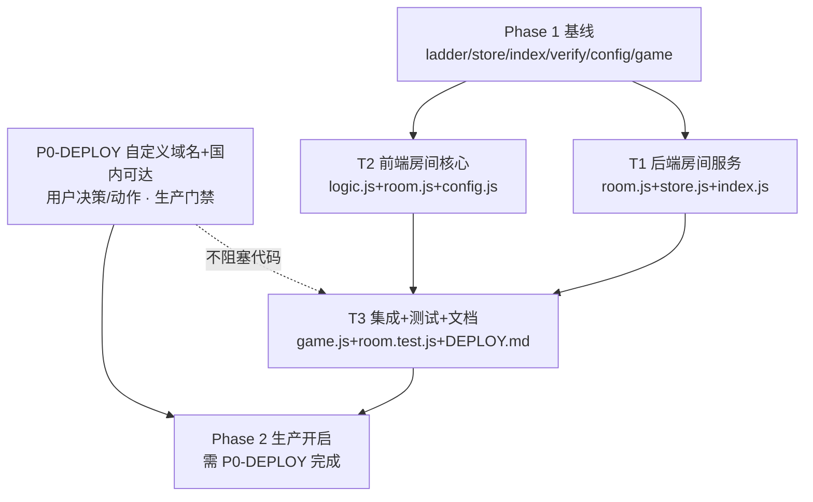

# 合成能量 · Phase 2 实时房间对战 — 实现计划 + 任务分解（架构规划）

> 作者：Bob（架构师） · 文档类型：**Phase 2 专项规划**（部分工作流，仅架构规划）
> 输入：现有 `docs/system_design.md` 的 **§1.3 / §2 / §3 / §4.2 / §7 / §8** 的 Phase 2 章节（已落地 Phase 1，本计划在其基础上精炼）
> **本计划新增约束**：近期发现 `*.vercel.app` 在**国内（抖音客户端）超时/不可达**，需将「自定义域名 + 国内可达路径」作为 Phase 2 轮询的**前置依赖**。
> 范围：实时房间对战（6 位码建房/加入、同房同种子、1.5s 轮询、服务端定胜负）。**不引入新托管平台、不引入新 npm 依赖**（与既有约束一致）。

---

## 0. 文档定位

- Phase 1（异步天梯）**已上线/已实现**，本计划**不重复**其设计，仅在其后端 `store/index/verify` 与前端 `config/game` 的既有模式上**增量扩展** Phase 2。
- 本计划 = **可直接开工的实现计划 + 任务分解 + 需用户拍板的决策点 + 自定义域名前置依赖**。
- 既有全局类图/时序图见 `docs/class-diagram.mermaid`、`docs/sequence-diagram.mermaid`（已含 Room 类与房间时序）。本计划新增的**精炼版**见 `docs/phase2-class-diagram.mermaid`、`docs/phase2-sequence-diagram.mermaid`（聚焦房间 + 轮询容错）。

---

## 1. ⚠️ 关键约束：\*.vercel.app 国内超时 → 自定义域名是轮询可达性的前置依赖

### 1.1 事实

- Vercel 的**默认域名 `*.vercel.app`** 以及其全球边缘（含绑定的自定义域名）在**中国大陆（抖音客户端所在网络）普遍超时 / 高延迟 / 间歇性不可达**（Vercel 无中国大陆节点，流量经境外回源，受 GFW 限速）。
- 抖音小游戏客户端网络栈为 `tt.request`，**必须 HTTPS 且域名加入开放平台「服务器域名」白名单**；请求失败（`fail` 回调）即视为超时，无内置长超时兜底。
- 现有 `config.js` 的 `RANK_ENDPOINT = 'https://douyin-merge-game.vercel.app/api'`（正是 `*.vercel.app`）。

### 1.2 为什么 Phase 2 比 Phase 1 更致命

| 维度 | Phase 1（天梯） | Phase 2（房间轮询） |
|------|----------------|---------------------|
| 请求频率 | 每局结束 1~2 次 | **每 1.5s 一次 `GET /room/state` + 落子时 `POST /room/progress`**（常驻） |
| 超时后果 | 结算卡失败可重试，影响小 | **轮询持续超时 = 看不到对手进度 = 实时对战不可用**（硬阻塞） |
| 可降级 | 可降级为本地「合成对手」 | 无对手则对战无意义，不可降级 |

> 结论：**Phase 1 用 `*.vercel.app` 勉强能跑；Phase 2 的常驻轮询在 `*.vercel.app` 下基本不可用**。这是 Phase 2 能否上线的**第一前提**。

### 1.3 三种可达性方案对比（需用户拍板）

| 方案 | 做法 | 新平台 | 国内可达 | 推荐 |
|------|------|--------|----------|------|
| **A（推荐）** | Vercel 不变（唯一计算后端），**绑定自定义域名**（如 `api.your-cn-domain.com`），并在其**前面叠加一层国内可达的 CDN/反代**（阿里云 CDN / 腾讯云 CDN / Cloudflare-China / 国内 ECS+Nginx 反代到 Vercel 源站） | 仅增「CDN/反代层」，**不新增计算托管平台**（Vercel 仍是唯一函数后端） | ✅ 可达 | ⭐⭐⭐⭐⭐ |
| B | 把后端整体迁到国内可达托管（阿里云函数计算 / 腾讯云云函数 / 国内 VPS） | **需新托管平台**（违反「零新平台」基线） | ✅ 可达 | ⭐⭐（除非用户放弃零新平台约束） |
| C | 直接用 `*.vercel.app`，不加任何可达层 | 无 | ❌ 超时 | ❌ 不可行（Phase 2 生产不可用） |

### 1.4 结论（架构前置依赖）

- **自定义域名 + 国内可达路径 = Phase 2 轮询可达性的硬前置依赖**，但它属于**部署/基础设施决策，不是代码阻塞项**：
  - 代码侧只需把 `config.js` 的 `RANK_ENDPOINT` 从 `https://xxx.vercel.app/api` 改为**国内可达的自定义域名**即可，**零代码改动**（域名已集中在该变量）。
  - 所有 Phase 2 工程任务**可立即并行开工**，以 `localhost`（开发者工具勾「不校验合法域名」）或已加白名单的可达域名做联调。
  - 仅当要**真机/生产**开启房间对战时，才必须完成 §9 决策 #1（选 A 或 B）。
- 因此本计划把「自定义域名/可达性」列为 **P0 部署前置（用户决策/动作）**，独立于 T1–T3 工程任务（见 §6 依赖图）。

---

## 2. 实现方案（在现有 Phase 2 章节基础上精炼）

### 2.1 传输：坚持「方案 A：Upstash 状态总线 + 前端轮询 1.5s」，明确排除 SSE / WS

- **不采用 SSE**：SSE 是长连接，Vercel serverless 需配 `maxDuration` 且长连接在国内更不稳，收益有限（轮询 1.5s 对 2048 单局分钟级已足够），**故 `vercel.json` 本次不改**（与 §3 原结论一致）。
- **不采用 `tt.connectSocket`**：需外部 WS 托管（违反「零新平台」），直接排除。
- 轮询目标为**同一 `RANK_ENDPOINT`**（与天梯共用域名，不加独立域名），路径挂 `/room/*`。

### 2.2 公平性与「无 WS 的同步开局」补偿设计（对原 §1.3 的精炼）

原设计「建房生成 seed，双方用同 seed 开局」在**无 WS 推送**下需解决「双方何时同时开始」：

- `create`：服务端生成 6 位 `code` + 32 位随机 `seed`，`status=waiting`，`startAt=null`，`EXPIRE 600s`。
- `join`：第 2 人加入后，`status=playing`，并写 `startAt = Date.now() + 3000`（3s 缓冲），双方通过轮询 `GET /room/state` 读到同一 `startAt`。
- **客户端**本地时钟 ≥ `startAt` 时再 `initGame(makeRng(seed))` 并启动倒计时——**无需 WS 即实现双方近似同步开局**（3s 缓冲吸收轮询抖动）。
- 房主（`waiting` 期间）轮询频率可降为 1s（仅等对手加入），进入 `playing` 后升为 1.5s。

### 2.3 seeded PRNG：`src/logic.js` 注入式 `rng`（最小改动）

`logic.js` 的 `initGame(rng)` / `move(state,dir,rng)` / `spawnTile(grid,rng)` **已支持注入 `rng`**，仅默认 `Math.random`。新增：

- `makeRng(seedStr)`：用 `xmur3(seedStr)` 派生 32 位初值，喂 `mulberry32(a)` 返回 `()=>[0,1)`。
- 房间模式下客户端 `const rng = Logic.makeRng(String(room.seed))`，传入 `initGame(rng)` 与每次 `move`。
- **公平性**：双方同 `seed` → 同初始 RNG 序列；各自落子序列不同但起点一致，**RNG 零优势**，等价于「同房同随机种子」。服务端只存 `seed`，不跑 PRNG（服务端无需确定性）。

### 2.4 容错轮询（针对国内延迟的必须设计）

每次 `GET /room/state` / `POST /room/progress` 必须：

- **请求超时**：用 `Promise.race([tt.request, timeout(3500ms)])` 兜底（抖音 `tt.request` 无原生 timeout）。
- **指数退避**：连续失败时间隔 1.5s → 3s → 4.5s（上限 6s），成功一次即回到 1.5s 基频。
- **本地不阻塞**：单次轮询失败**绝不影响本地棋盘**——本地玩家照常落子，仅「对手进度」显示滞后/旧值；UI 显示「同步中…」但不卡死。
- **轮询生命周期**：仅在 `screen==='room' && status==='playing'` 时轮询；`finished` 后停止并保留结算卡。

### 2.5 重连

断线后用 `code` + 本地 `uid` 调 `POST /room/join`：服务端识别 `players[uid]` 已存在则**不重复加人**、仅刷新 `updatedAt`，返回现有 `seed/startAt/status`；客户端据此恢复轮询/结算。

---

## 3. 文件列表（Phase 2 增量）

> 路径相对 `douyin-merge-game/`。`[P2]`=Phase 2，`(新)`=新增，`(改)`=修改。基础设施（Phase 1）已存在，**无项目脚手架任务**。

### 后端
| 路径 | 动作 | 说明 |
|------|------|------|
| `server/room.js` | (新) [P2] | `RoomService`：create/join/progress/getState/submitResult + `computeMatch`（胜负判定）+ `makeSeed`/`makeCode`。复用 `verify.js`。 |
| `server/store.js` | (改) [P2] | 三后端各实现房间方法：`roomSet`(HASH+EXPIRE 600s)/`roomGet`/`roomProgress`(HSET)/`roomResult`(HSET)/`roomTouch`(EXPIRE 续期)。 |
| `server/index.js` | (改) [P2] | 新增 `/api/room/*` 路由（create/join/progress/state/result），复用 `verifyPayload` 与现有 `sendJson`。 |
| `server/verify.js` | 不变 | 直接复用（Phase 1 已抽取）。 |

### 前端
| 路径 | 动作 | 说明 |
|------|------|------|
| `src/logic.js` | (改) [P2] | 新增 `makeRng(seedStr)`（xmur3+mulberry32）；`initGame/move/spawnTile` 已支持注入 rng，无需改签名。 |
| `src/room.js` | (新) [P2] | `RoomClient`（签名 + create/join/progress/state/result，含超时+指数退避+竞态守门）+ Canvas UI（大厅/等待/对战 HUD/结算卡）。 |
| `config.js` | (改) [P2] | 由 `RANK_ENDPOINT` 派生 `ROOM_CREATE/JOIN/PROGRESS/STATE/RESULT` 路径（getter 模式，与 `LADDER_*` 一致）。 |
| `game.js` | (改) [P2] | 房间入口按钮（左上，避系统胶囊）+ 用 `seed` 开局（接 §2.2/§2.3）+ 轮询循环接入 + 返回键双形态兼容 + 重连。 |

### 测试 / 文档
| 路径 | 动作 | 说明 |
|------|------|------|
| `test/room.test.js` | (新) [P2] | 建房/加入/进度/结算/轮询/种子一致性；双端模拟对战。 |
| `server/DEPLOY.md` | (改) [P2] | 新增「自定义域名 + 国内可达路径」章节（§9 决策 #1 的落地步骤）。 |

---

## 4. 数据结构与接口

> 完整类图见 `docs/phase2-class-diagram.mermaid`（精炼版，聚焦房间）。既有全局类图 `docs/class-diagram.mermaid` 已含 `Room/RoomService/Store` 接口，本计划在其上**补充** `startAt`、`matchResult`、`SeededRng` 与轮询容错。

### 4.1 房间状态（存 Upstash Redis，HASH + EXPIRE 600s）

```jsonc
{
  "code": "A1B2C3",
  "seed": 123456789,            // 同房同种子（32 位随机，建房生成）
  "status": "waiting|playing|finished",
  "createdAt": 1690000000000,
  "startAt": 1690000003000,     // 第2人加入后写入：双方本地时钟≥此值才开始（无WS同步补偿）
  "ttl": 600,
  "players": {
    "u_p1": { "uid":"u_p1","name":"P1","ready":true,"score":0,"steps":0,"boardSummary":"","updatedAt":0 },
    "u_p2": { "uid":"u_p2","name":"P2","ready":true,"score":0,"steps":0,"boardSummary":"","updatedAt":0 }
  },
  "results": {                  // 双方提交齐 → computeMatch 写 matchResult
    "u_p1": { "uid":"u_p1","score":2048,"steps":120,"ts":1690000060000,"won":true }
  },
  "matchResult": 0              // 0=未定 1=P1胜 2=P2胜 3=平
}
```

### 4.2 接口契约（REST 落地，替代 WS；沿用 `{code,data,message}` 信封）

| 逻辑消息 | REST | 方向 | 说明 |
|----------|------|------|------|
| `create` | `POST /api/room/create {uid,name,ts,sig}` → `{code,seed,status,startAt}` | C→S | 建房，生成 seed |
| `join` | `POST /api/room/join {code,uid,name,ts,sig}` → `{seed,players,status,startAt}` | C→S | 加入/重连，第2人触发 `playing`+`startAt` |
| `progress` | `POST /api/room/progress {code,uid,ts,sig,score,steps,boardSummary}` → `{ok:true}` | C→S | 落子时上报（节流：每步或 ≥500ms） |
| `state`（轮询） | `GET /api/room/state?code=&uid=&ts=&sig=` → `{status,startAt,opponent:{score,steps,boardSummary,updatedAt},matchResult,myScore,oppScore}` | C→S | 1.5s 轮询 |
| `result` | `POST /api/room/result {code,uid,ts,sig,score,steps,won}` → `{ok:true}` | C→S | 提交终局 |
| `match_result` | 轮询 `state` 返回 `matchResult>0` 时携带 `{myScore,oppScore}` | S→C | 定胜负 |

**胜负判定（`computeMatch`，服务端权威）**：
- 任一方 `won=true`（先到 2048）→ 该方胜，对方负。
- 均未 `won` 且 `startAt + MATCH_TIMEOUT(默认180000ms)` 到点 → 比分高者胜，平则 `matchResult=3`。
- 双方结果齐 或 到点 → 写 `matchResult` + `status=finished`；对手分数来自可信房间状态，客户端无法伪造。

**签名**：沿用 HMAC-SHA256(`RANK_SECRET`)，canonical `uid|score|steps|ts`（create/join 用 `uid|ts`）。读取接口 `state` 需 `sig`（与 `rank`/`ladder/history` 一致）。`SIGN_TTL` 默认 300s。

---

## 5. 程序调用流程

> 完整轮询时序见 `docs/phase2-sequence-diagram.mermaid`。要点：建房→加入(触发 startAt)→双方轮询读到 startAt→本地同步倒计时开局→落子上报+1.5s 轮询对手→终局提交→轮询到 matchResult→结算卡。每次网络调用均套「超时 3.5s + 指数退避 + 本地不阻塞」（见 §2.4）。

---

## 6. 任务分解（分组、≤5、可立即开工）

> 说明：基础设施已存在（Phase 1 完成），**无「项目脚手架」任务**；工程任务 T1–T3 均**仅依赖既有 Phase 1 基线**，T1/T2 可并行，T3 依赖 T1+T2。
> **「自定义域名/可达性」是独立于 T1–T3 的 P0 部署前置（用户决策），不阻塞代码开工**，仅阻塞生产真机开启。

| ID | 任务 | 源文件（≥3） | 依赖 | 优先级 |
|----|------|--------------|------|--------|
| **P0-DEPLOY** | **部署前置（用户决策/动作）：自定义域名 + 国内可达路径**。落地 §9 决策 #1：在 Vercel 绑自定义域名，前面叠国内可达 CDN/反代（方案 A）；或迁国内托管（方案 B）。改 `config.js` 的 `RANK_ENDPOINT` 指向可达域名。仅部署动作，无代码逻辑改动。 | `config.js`(改值)、`server/DEPLOY.md`(改：新增章节) | 无（与 T1–T3 并行） | **P0（生产门禁）** |
| **T1** | **后端房间服务**：`RoomService`（create/join/progress/getState/submitResult + computeMatch + makeSeed/makeCode，复用 verify）；`store.js` 三后端房间方法（HASH+EXPIRE 600s + 续期）；`index.js` 新增 `/api/room/*` 路由。 | `server/room.js`(新)、`server/store.js`(改)、`server/index.js`(改) | 既有 Phase 1 基线 | P1 |
| **T2** | **前端房间核心**：`logic.js` 增 `makeRng`（xmur3+mulberry32，注入式 rng）；`src/room.js` 房间客户端（签名+5 接口+超时3.5s+指数退避+竞态守门）+ Canvas UI（大厅/等待/对战HUD/结算）；`config.js` 派生 `ROOM_*` 路径。 | `src/logic.js`(改)、`src/room.js`(新)、`config.js`(改) | 既有 Phase 1 基线（联调依赖 T1） | P1 |
| **T3** | **集成挂载 + 测试 + 文档**：`game.js` 房间入口（左上避胶囊）+ seed 开局（接 §2.2/§2.3）+ 轮询循环 + 返回键兼容 + 重连；`test/room.test.js`（建房/加入/进度/结算/轮询/种子一致性/双端模拟）；`server/DEPLOY.md` 补自定义域名章节。 | `game.js`(改)、`test/room.test.js`(新)、`server/DEPLOY.md`(改) | T1, T2 | P1 |

> T1/T2 可用 `localhost`（开发者工具「不校验合法域名」）**并行开发**；T3 做端到端联调与回归（保持既有 `test/*.test.js` 全过）。

---

## 7. 依赖包

| 包 / 模块 | 用途 | 阶段 | 是否新增 |
|-----------|------|------|----------|
| `server/verify.js`（Node `crypto`） | 验签（复用） | P2 | 否 |
| Upstash Redis REST（raw `fetch`，零 SDK） | 房间状态总线（复用 Phase 1 凭据） | P2 | 否 |
| `src/hmac.js`（纯 JS HMAC-SHA256） | 前端签名（复用） | P2 | 否 |
| `src/logic.js` 内 `mulberry32`/`xmur3` | seeded PRNG（自实现，零依赖） | P2 | 否 |
| **新增 npm 依赖** | —— | —— | **无** |

---

## 8. 共享知识（Phase 2 补充，延续 §7 约定）

- **域名集中**：所有 `/room/*` 走 `RANK_ENDPOINT`，**换可达域名只改 `config.js` 一处**，后端/前端代码零改动。
- **字段/时间/签名**：`snake_case`；`ts` 秒级；HMAC-SHA256(`RANK_SECRET`)，服务端重拼 canonical 再验；`SIGN_TTL` 默认 300s；`secret` 空=开发跳过。
- **错误码信封**（沿用）：`0`成功 / `1`参数错 / `2`签名失效 / `3`未找到(房间/对手/码) / `4`频率限制 / `5`服务端错。
- **轮询容错三原则**（强制）：① `Promise.race` 超时 3.5s；② 失败指数退避（1.5→3→4.5→上限6s，成功即复位）；③ 失败不影响本地棋盘。
- **种子一致性**：`seed` 仅由服务端 `create` 生成并下发给双方；客户端 `makeRng(seed)` 后必须**每次 `move` 都传同一 `rng` 实例**，否则双方棋盘漂移。
- **同步开局**：客户端仅在本地时钟 ≥ `startAt` 才 `initGame(makeRng(seed))`；`startAt` 由第 2 人加入时服务端写定（now+3000）。
- **存储键**：`room:<code>`（HASH，EXPIRE 600s，读后 `roomTouch` 续期）；`players`/`results` 为 HASH 内字段。
- **CORS**：沿用现有 `Access-Control-Allow-Origin: *`。

---

## 9. 需用户拍板的决策点

| # | 待确认点 | 推荐默认值 | 影响 |
|---|----------|-----------|------|
| **1（关键）** | **Phase 2 国内可达性方案**：A=Vercel+自定义域名+国内CDN/反代（推荐，零新计算平台）；B=迁国内托管（违「零新平台」）；C=`*.vercel.app`（不可行）。 | **A** | Phase 2 能否在国内真机可用（前置门禁） |
| 2 | 自定义域名归属：用现有域名子域（如 `api.xxx.com`）还是新购 | 复用现有已备案域名子域 | 部署步骤、ICP 备案 |
| 3 | 房间人数 | 固定 **2 人**（PRD「双方」）；暂不支持观战 | 房间模型 |
| 4 | 胜负规则 | 先到 2048 即胜；或 `MATCH_TIMEOUT=180000ms` 到点比分高者胜，平分平局 | `computeMatch` 逻辑 |
| 5 | 轮询频率 | 等待期 1s，对战期 **1500ms**；超时 3.5s + 退避上限 6s | 实时性/流量 |
| 6 | 房间码 TTL 与重连 | `TTL=600s`；断线用 `code+uid` 重连（按 uid 识别，不重复加人） | 房间生命周期 |
| 7 | 同步开局缓冲 | `startAt = join2nd 时 now + 3000ms` | 双方近似同步 |

> #1 为**架构硬前置**，强烈建议按 A 确定；#3–#7 为体验参数，可先以推荐值开发，后续由 PM 调参。

---

## 10. 任务依赖图



> 解读：T1/T2 在 Phase 1 基线上**并行**；T3 收口联调与回归；**P0-DEPLOY 与代码并行推进，但真机生产开启必须等 P0-DEPLOY 落地**（否则轮询在国内超时）。
