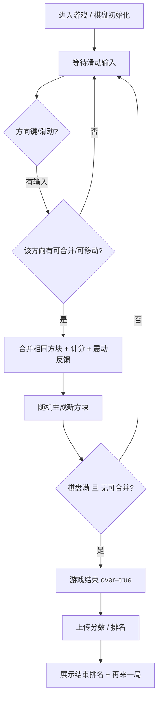
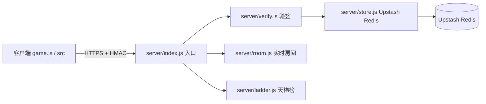

# 《合成能量》软件说明书（用户手册）初稿

> 软件名称：**《合成能量》**　版本号：**V1.0**　著作权人：个人（与抖音开放平台主体、隐私政策运营者一致）
> 文档性质：**软著申请用软件说明书 / 用户手册初稿**，依据《计算机软件著作权登记办法》"说明书应清晰说明软件功能、运行环境、操作方法"要求撰写。
> 篇幅说明：本章节 + 截图占位合计**不少于 15 页**（A4）当量；因无法自动生成真截图，凡需图处均标注"建议截图：XXX 界面 / 来源界面"，正式提交前须以真实运行画面替换占位。
> 抽取基准：源码与功能描述基于 git 仓库 HEAD 提交 `9d6af64`。

---

## 第一章　软件概述

**建议截图：游戏启动 Logo / 主界面（4×4 棋盘 + 当前分数）**

### 1.1 软件名称与用途
- **名称**：《合成能量》（英文名：Merge Energy）
- **类型**：2048 式数字合成休闲小游戏（单机核心玩法 + 联网排行榜 / 实时对战）
- **用途**：玩家通过上下左右滑动，使棋盘上相同数字方块合并为更大数字，累积分数；当棋盘填满且无可合并时游戏结束。主打轻量、即开即玩的碎片时间娱乐。

### 1.2 运行环境
| 项目 | 说明 |
| --- | --- |
| 运行平台 | 抖音小游戏运行时（`tt.*` API），运行于 **iOS / Android 抖音客户端**内 |
| 操作系统 | iOS 12+ / Android 8+（随抖音客户端要求） |
| 安装方式 | **无需应用商店安装**；抖音内搜索小游戏名或扫码即进入（见第二章） |
| 渲染方式 | HTML5 Canvas 2D（无 DOM/BOM，纯 `tt.*` 运行时） |
| 网络依赖 | 排行榜 / 天梯 / 实时对战需联网；核心单机玩法可离线进行 |

### 1.3 技术栈
| 层级 | 技术 |
| --- | --- |
| 客户端 | JavaScript + Canvas（`game.js`、`src/*.js`），抖音 `tt.*` API（渲染、输入、震动、登录、广告、分享） |
| 后端 | Vercel Serverless Functions（`server/index.js` 等） |
| 存储 | Upstash Redis（`server/store.js` 封装） |
| 通信域名 | `kejingbbao.cn`（已加抖音合法域名白名单 + EdgeOne HTTPS） |
| 安全 | HMAC-SHA256 请求签名（`RANK_SECRET`），防刷分 |

> 说明：本软件为纯前端 Canvas 小游戏 + 轻量 Serverless 后端，无独立数据库服务进程，数据托管于 Upstash Redis（托管服务）。

---

## 第二章　安装与启动

**建议截图：抖音内搜索结果页 / 小游戏扫码进入页 / 首次运行隐私政策弹窗**

### 2.1 进入方式（不依赖应用商店）
1. 打开手机抖音 App（iOS / Android）。
2. 在抖音搜索框输入"**合成能量**"，点击搜索结果中的小游戏卡片；或扫描游戏分享二维码进入。
3. 首次进入加载小游戏包（主包 ≤ 4 MB，整体 ≤ 20 MB），无需在应用商店下载安装。

### 2.2 首次运行流程
1. 小程序加载完成后，展示 **加载图**（不含进度条、非真实数值，符合平台规范）。
2. **首次运行弹窗 + 同意**：弹出《隐私政策》弹窗，玩家须点击"同意"方可进入；"不同意"则退出。
   > 📌 注：隐私政策弹窗与入口由工程师按合规要求**新增**（对应 `docs/privacy-policy.md`），确保首次运行前弹窗提示、≤4 次点击可达、含收集目的/方式/范围/处理者联系方式、披露第三方 SDK。
3. 进入主界面，展示 4×4 棋盘与初始方块，可立即开始游戏。

### 2.3 权限说明
- 本游戏**不强制索取**通讯录 / 相册 / 位置等非必要权限。
- 实时房间对战涉及社交功能，通过 `tt.login` 完成实名 / 青少年模式相关能力，不读取非必要权限。

---

## 第三章　功能详述与操作

**建议截图：主界面棋盘 / 滑动合成动画 / 分数面板**

### 3.1 核心玩法（滑动合成 · 计分 · 结束判定）
- **操作**：手指在棋盘区域上下左右滑动，触发整行/整列方块向该方向滑动。
- **合并**：滑动方向上相邻的**相同数字**方块合并为原数字 2 倍（如 2+2→4），每次有效合并累加对应分数。
- **生成**：每次有效滑动后，在空白处随机生成一个新方块（通常为 2 或 4）。
- **计分**：合并产生的数字计入总分（`score`），实时显示于面板。
- **结束判定**：当棋盘填满且**任意方向均无可合并方块**时，判定游戏结束（`over = true`）。

#### 玩法主循环流程图（mermaid）

### 3.2 震动反馈
- 每次有效合并触发轻微震动（`tt.vibrateShort`），增强操作手感。
- 提供**震动开关**（设置项）：玩家可关闭震动；开关状态本地持久化。
- **建议截图：设置页震动开关**。

### 3.3 结束排名与"再来一局"
- 游戏结束后，客户端将本次 `score` 经 HMAC 签名后提交后端，返回**本局排名**（如"超过 X% 玩家"）。
- 展示"**再来一局**"按钮，点击即重置棋盘重新开始。
- **建议截图：结束结算页（分数 + 排名 + 再来一局）**。

### 3.4 天梯榜
- 基于累计/单局分数计算**天梯积分**，后端 `server/ladder.js` 维护名次。
- 玩家可查看自己在天梯中的名次与积分；榜单经 HMAC 校验防刷分。
- **建议截图：天梯榜列表（名次 / 积分 / 玩家标识）**。

### 3.5 实时房间对战
- **创建房间**：玩家创建对战房间，获得房间号；**加入房间**：好友输入房间号加入。
- **同步**：双方操作通过 `kejingbbao.cn` 的 WebSocket/HTTP 实时同步棋盘状态与分数。
- **结算**：对战结束按分数/规则判定胜负并结算战绩。
- **实名依赖**：实时房间对战属联网社交玩法，须通过 `tt.login` 完成实名 / 青少年模式校验后方可匹配（呼应防沉迷要求）。
- **建议截图：创建/加入房间页 / 对战同步界面 / 战绩结算页**。

### 3.6 隐私政策入口
- 主界面或设置页提供"隐私政策"入口，**≤4 次点击**可达（首次运行弹窗亦可直接查看）。
- 隐私政策文本独立成篇，与用户协议分离，含收集目的/方式/范围/处理者联系方式与第三方 SDK 披露。
- 📌 注：该入口与文本由工程师按合规要求**新增/完善**（对应 `docs/privacy-policy.md`、`docs/user-agreement.md`），提交前须确认名称/主体与抖音后台一致。
- **建议截图：设置页隐私政策入口 / 隐私政策正文**。

---

## 第四章　数据结构与接口

**建议截图：后端接口调用示意（可用架构图替代）**

### 4.1 核心客户端状态
| 字段 | 类型 | 说明 |
| --- | --- | --- |
| `grid` | number[][] | 4×4 棋盘，存储各格数字（0 表示空） |
| `score` | number | 当前累计分数 |
| `over` | boolean | 是否已结束（true = 游戏结束） |

### 4.2 Upstash Redis 命令封装（`server/store.js`）
- 使用 Upstash Redis REST/SDK 封装常用操作：`get` / `set` / `zadd` / `zrevrange`（天梯有序集合）/ `expire` 等。
- 连接信息经环境变量注入，不硬编码密钥。
- 关键数据设置合理过期时间，避免无限增长。

### 4.3 接口与签名校验
- **核心接口**（Vercel Serverless，`server/index.js`）：提交分数、查询天梯、房间创建/加入/同步/结算。
- **签名校验**：客户端请求携带 HMAC-SHA256 签名（`src/hmac.js` 生成），服务端 `server/verify.js` 以 `RANK_SECRET` 复核，校验通过才接受，防止伪造分数（防刷分）。
- **通信安全**：全链路 HTTPS（EdgeOne 强制 HTTPS），域名 `kejingbbao.cn` 已在抖音合法域名白名单。

#### 后端模块关系图（mermaid）

---

## 第五章　异常处理与兼容性

### 5.1 网络失败降级
- 排行榜 / 天梯 / 对战等联网功能请求失败时，**单机核心玩法不受影响**，可继续游戏。
- 分数提交失败时本地缓存，待网络恢复后重试；对战同步超时给出提示并可退出房间。
- **建议截图：弱网/超时提示弹窗**。

### 5.2 防刷分
- 所有分数提交须经 HMAC-SHA256 签名（`RANK_SECRET`），服务端复核；签名不符或无签名直接拒绝。
- 对异常高频提交、明显超量程分数做过滤与限流，保障榜单公平。

### 5.3 兼容性与适配
- 适配 iOS / Android 抖音客户端；兼容刘海屏 / 挖孔屏安全区。
- 加载图禁显示进度条、禁非真实数据，符合平台自审规范。
- 包体整体 ≤ 20 MB（主包 ≤ 4 MB），满足抖音小游戏包体上限。

---

## 第六章　版本与版权声明

- 软件名称《合成能量》V1.0，代码、美术、名称归属运营者（著作权人）所有。
- 遵守抖音开放平台规范与《计算机软件保护条例》；第三方 SDK / 接口使用符合各自条款。
- 本说明书为软著申请配套材料，功能描述与提交源码（前后各 30 页）一致。

---

## 附：截图占位清单（正式提交前须替换为真图）
| 章节 | 建议截图 | 来源界面 |
| --- | --- | --- |
| 第一章 | 启动 Logo / 主界面棋盘 | 游戏主界面 |
| 第二章 | 搜索/扫码进入、隐私弹窗 | 抖音客户端 + 首次运行弹窗 |
| 第三章 | 核心玩法、震动开关、结束排名、天梯榜、房间对战、隐私入口 | 对应游戏内界面 |
| 第四章 | 接口/架构示意 | 可用本章 mermaid 图替代 |
| 第五章 | 弱网提示 | 游戏内异常提示 |

> ⚠️ **重要声明**：本说明书为**初稿**。正式向中国版权保护中心提交前，须以《合成能量》**真实运行截图**替换上述所有占位，确保图文与运行版本一致；截图造假将导致软著驳回。
