# 《合成能量》软件说明书（用户手册）

> 软件名称：**《合成能量》**　版本号：**V1.0**　著作权人：个人（与抖音开放平台主体、隐私政策运营者一致）
> 文档性质：**软著申请用软件说明书 / 用户手册**，依据《计算机软件著作权登记办法》"说明书应清晰说明软件功能、运行环境、操作方法"要求撰写。
> 篇幅说明：本章节 + 嵌入真实运行截图合计**不少于 15 页**（A4）当量；已尽量使用真实运行截图替换占位，部分暂无对应截图的章节仍保留文字说明。
> 抽取基准：源码与功能描述基于 git 仓库 HEAD 提交 `9d6af64`。
> 截图说明：**已嵌入真实运行截图**（截图日期见各图）。未匹配到的章节保留占位说明，详见文末《缺失截图清单》与 `screenshots/mapping.md`。

---

## 第一章　软件概述

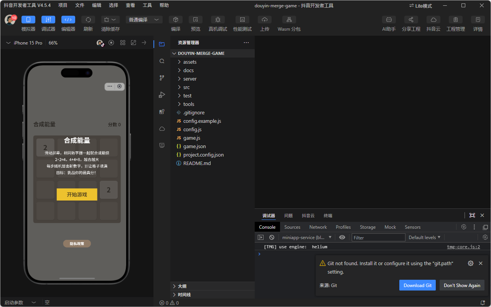
*图 1-1：启动/主界面（2026-07-26 模拟器运行截图）*

### 1.1 软件名称与用途
- **名称**：《合成能量》（英文名：Merge Energy）
- **类型**：2048 式数字合成休闲小游戏（单机核心玩法 + 联网排行榜 / 实时对战）
- **用途**：玩家通过上下左右滑动，使棋盘上相同数字方块合并为更大数字，累积分数；当棋盘填满且无可合并时游戏结束。主打轻量、即开即玩的碎片时间娱乐。

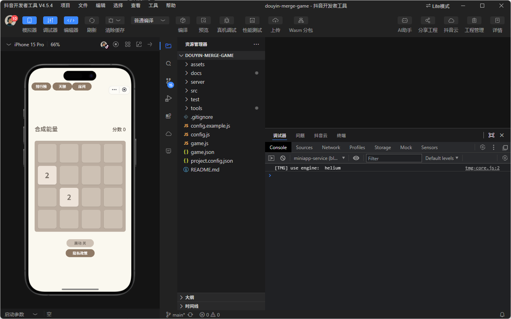
*图 1-2：初始空棋盘界面——两个初始方块(2)、分数 0、底部"震动开"/"隐私政策"按钮（2026-07-26 模拟器运行截图）*

### 1.2 运行环境
| 项目 | 说明 |
| --- | --- |
| 运行平台 | 抖音小游戏运行时（`tt.*` API），运行于 **iOS / Android 抖音客户端**内 |
| 操作系统 | iOS 12+ / Android 8+（随抖音客户端要求） |
| 安装方式 | **无需应用商店安装**；抖音内搜索小游戏名或扫码即进入（见第二章） |
| 渲染方式 | HTML5 Canvas 2D（无 DOM/BOM，纯 `tt.*` 运行时） |
| 网络依赖 | 排行榜 / 天梯 / 实时对战需联网；核心单机玩法可离线进行 |

### 1.3 技术栈
| 层级 | 技术 |
| --- | --- |
| 客户端 | JavaScript + Canvas（`game.js`、`src/*.js`），抖音 `tt.*` API（渲染、输入、震动、登录、广告、分享） |
| 后端 | Vercel Serverless Functions（`server/index.js` 等） |
| 存储 | Upstash Redis（`server/store.js` 封装） |
| 通信域名 | `kejingbbao.cn`（已加抖音合法域名白名单 + EdgeOne HTTPS） |
| 安全 | HMAC-SHA256 请求签名（`RANK_SECRET`），防刷分 |

> 说明：本软件为纯前端 Canvas 小游戏 + 轻量 Serverless 后端，无独立数据库服务进程，数据托管于 Upstash Redis（托管服务）。

---

## 第二章　安装与启动

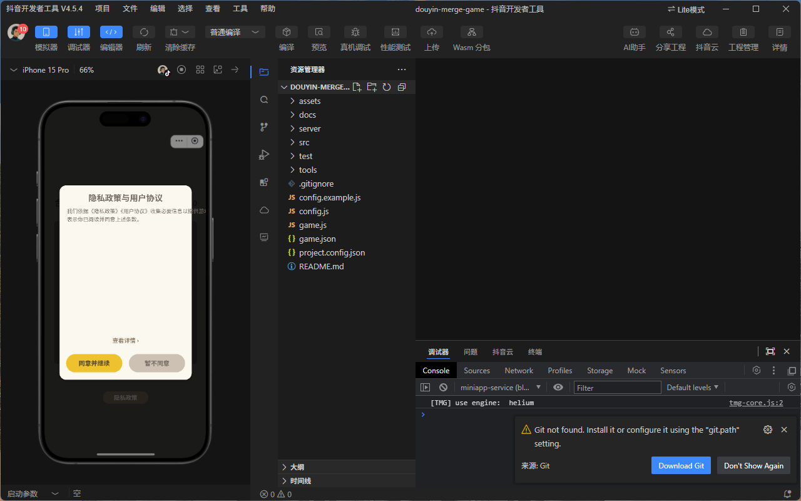
*图 2-1：首次运行《隐私政策与用户协议》弹窗（2026-07-26 模拟器运行截图）*

### 2.1 进入方式（不依赖应用商店）
1. 打开手机抖音 App（iOS / Android）。
2. 在抖音搜索框输入"**合成能量**"，点击搜索结果中的小游戏卡片；或扫描游戏分享二维码进入。
3. 首次进入加载小游戏包（主包 ≤ 4 MB，整体 ≤ 20 MB），无需在应用商店下载安装。

> 说明：进入方式依赖抖音平台搜索 / 扫码能力（平台层功能），并非游戏内独立界面，故不配置游戏运行截图。

### 2.2 首次运行流程
1. 小程序加载完成后，展示 **加载图**（不含进度条、非真实数值，符合平台规范）。
2. **首次运行弹窗 + 同意**：弹出《隐私政策》弹窗（见图 2-1），玩家须点击"同意并继续"方可进入；"暂不同意"则退出。
   > 📌 注：隐私政策弹窗与入口由工程师按合规要求**新增**（对应 `docs/privacy-policy.md`），确保首次运行前弹窗提示、≤4 次点击可达、含收集目的/方式/范围/处理者联系方式、披露第三方 SDK。
3. 进入主界面，展示 4×4 棋盘与初始方块，可立即开始游戏。

### 2.3 权限说明
- 本游戏**不强制索取**通讯录 / 相册 / 位置等非必要权限。
- 实时房间对战涉及社交功能，通过 `tt.login` 完成实名 / 青少年模式相关能力，不读取非必要权限。

---

## 第三章　功能详述与操作

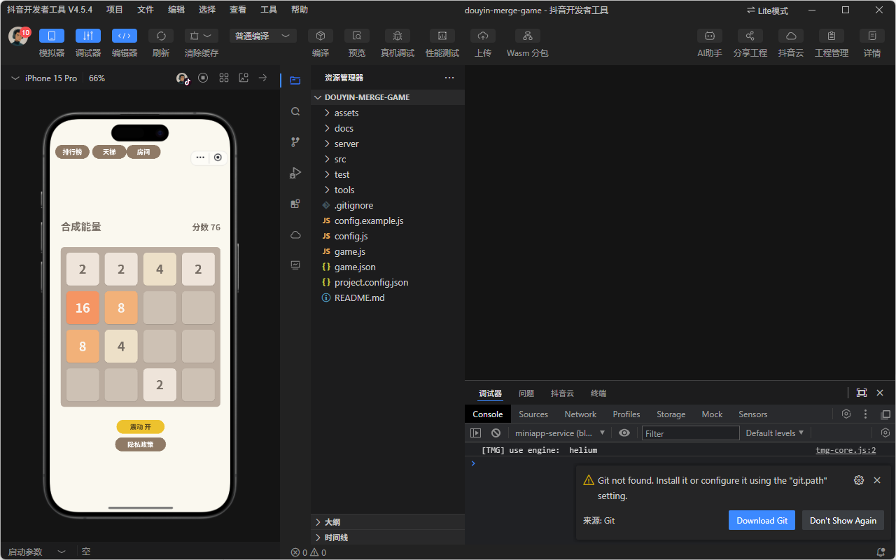
*图 3-1：核心玩法主界面——4×4 棋盘、分数面板、震动开关、排行榜/天梯/房间入口（2026-07-26 模拟器运行截图）*

### 3.1 核心玩法（滑动合成 · 计分 · 结束判定）
- **操作**：手指在棋盘区域上下左右滑动，触发整行/整列方块向该方向滑动。
- **合并**：滑动方向上相邻的**相同数字**方块合并为原数字 2 倍（如 2+2→4），每次有效合并累加对应分数。
- **生成**：每次有效滑动后，在空白处随机生成一个新方块（通常为 2 或 4）。
- **计分**：合并产生的数字计入总分（`score`），实时显示于面板。
- **结束判定**：当棋盘填满且**任意方向均无可合并方块**时，判定游戏结束（`over = true`）。

#### 玩法主循环流程图（mermaid）
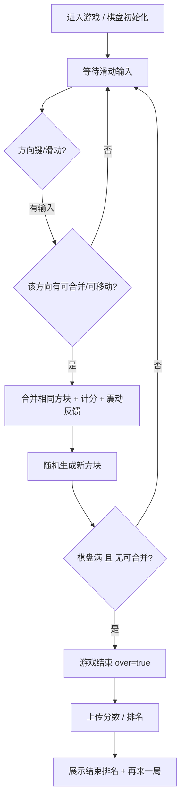

### 3.2 震动反馈
- 每次有效合并触发轻微震动（`tt.vibrateShort`），增强操作手感。
- 提供**震动开关**（设置项）：玩家可关闭震动；开关状态本地持久化。图 3-1 主界面底部可见"震动开"入口按钮。

> 说明：震动开关为棋盘正下方的嵌入式按钮（非独立设置页），已体现在图 3-1（main-board.png）/ 图 1-2（fresh-board.png）主界面底部"震动开"入口，故无独立设置页截图。

### 3.3 结束排名与"再来一局"
- 游戏结束后，客户端将本次 `score` 经 HMAC 签名后提交后端，返回**本局排名**（如"超过 X% 玩家"）。
- 展示"**再来一局**"按钮，点击即重置棋盘重新开始。

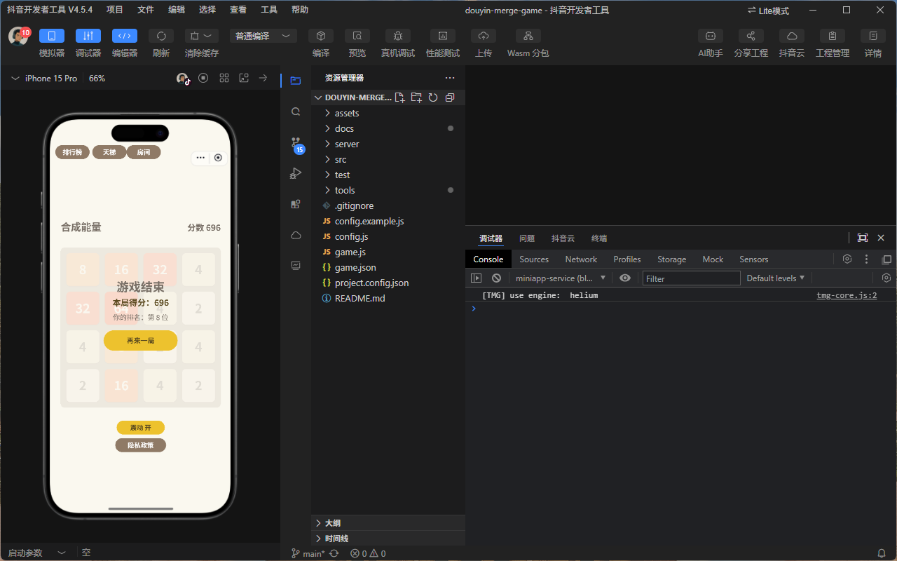
*图 3-6：游戏结束结算页——本局得分 696、排名第 8 位、"再来一局"按钮（2026-07-26 模拟器运行截图）*

### 3.4 天梯榜与排行榜
- 基于累计/单局分数计算**天梯积分**，后端 `server/ladder.js` 维护名次。
- 玩家可查看自己在天梯中的名次与积分；榜单经 HMAC 校验防刷分。
- 游戏同时提供**全球排行榜**功能，展示前 100 名玩家及本局排名。

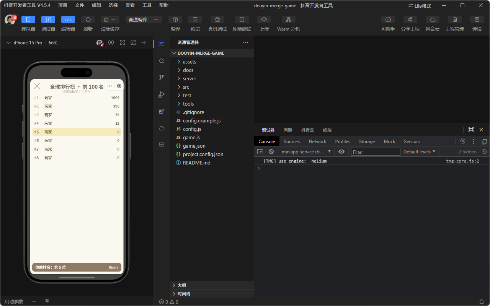
*图 3-2：全球排行榜（已修复、正常显示，2026-07-26 模拟器运行截图）*

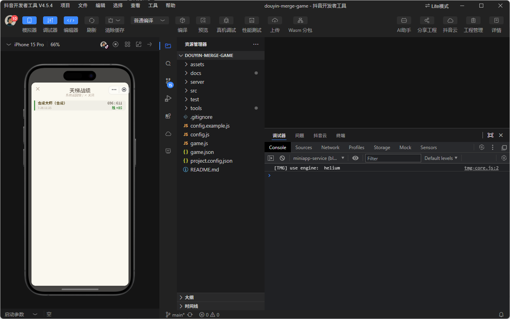
*图 3-2b：天梯综练榜——合战大师(浩然) 696:1611 胜+85（2026-07-26 模拟器运行截图）*

### 3.5 实时房间对战
- **创建房间**：玩家创建对战房间，获得房间号；**加入房间**：好友输入房间号加入。
- **同步**：双方操作通过 `kejingbbao.cn` 的 WebSocket/HTTP 实时同步棋盘状态与分数。
- **结算**：对战结束按分数/规则判定胜负并结算战绩。
- **实名依赖**：实时房间对战属联网社交玩法，须通过 `tt.login` 完成实名 / 青少年模式校验后方可匹配（呼应防沉迷要求）。

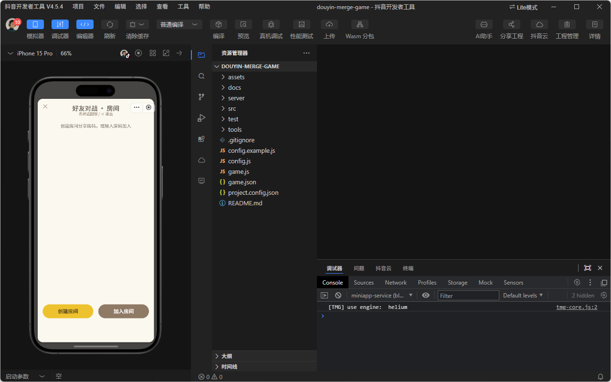
*图 3-3：好友对战·房间入口（2026-07-26 模拟器运行截图）*

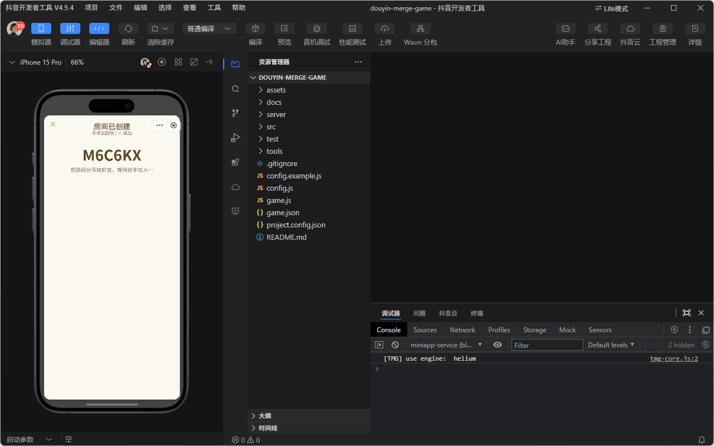
*图 3-4：房间已创建，展示房间号 M6C6KX（2026-07-26 模拟器运行截图）*

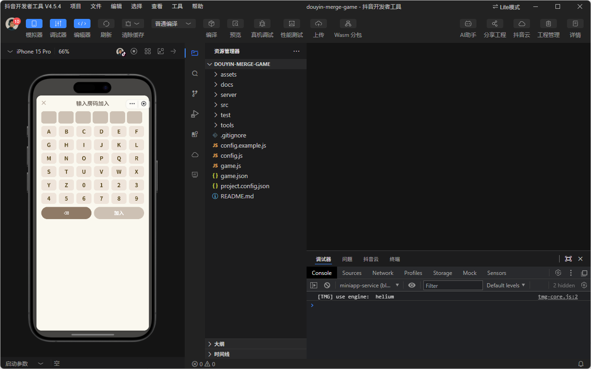
*图 3-5：输入房码加入对战（2026-07-26 模拟器运行截图）*

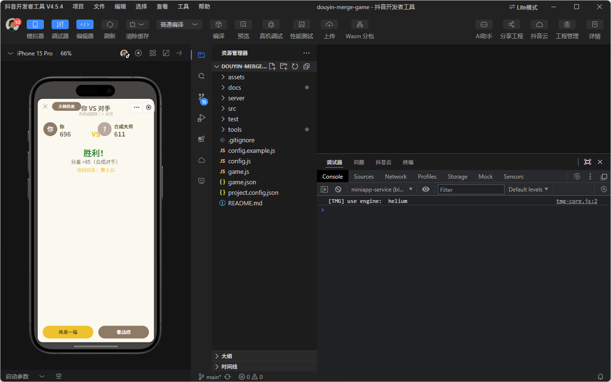
*图 3-6：房间对战结算——你 VS 对手、"胜利!"、分数+65（合成对手）、"再来一局"/"查看战绩"（2026-07-26 模拟器运行截图）*

### 3.6 隐私政策入口
- 主界面或设置页提供"隐私政策"入口，**≤4 次点击**可达（首次运行弹窗亦可直接查看）。图 2-1 为首次运行弹窗，图 3-1 主界面底部可见"隐私政策"按钮。
- 隐私政策文本独立成篇，与用户协议分离，含收集目的/方式/范围/处理者联系方式与第三方 SDK 披露。
- 📌 注：该入口与文本由工程师按合规要求**新增/完善**（对应 `docs/privacy-policy.md`、`docs/user-agreement.md`），提交前须确认名称/主体与抖音后台一致。

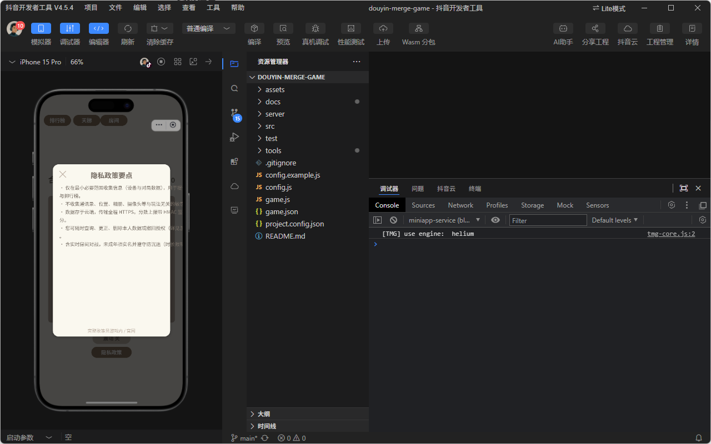
*图 3-7：隐私政策要点正文弹窗——完整收集目的/方式/范围说明、"确认同意"/"隐私政策"按钮（2026-07-26 模拟器运行截图）*

---

## 第四章　数据结构与接口

> 第四章以架构/流程说明为主，可用后端模块关系图辅助理解，不强制要求运行截图。

### 4.1 核心客户端状态
| 字段 | 类型 | 说明 |
| --- | --- | --- |
| `grid` | number[][] | 4×4 棋盘，存储各格数字（0 表示空） |
| `score` | number | 当前累计分数 |
| `over` | boolean | 是否已结束（true = 游戏结束） |

### 4.2 Upstash Redis 命令封装（`server/store.js`）
- 使用 Upstash Redis REST/SDK 封装常用操作：`get` / `set` / `zadd` / `zrevrange`（天梯有序集合）/ `expire` 等。
- 连接信息经环境变量注入，不硬编码密钥。
- 关键数据设置合理过期时间，避免无限增长。

### 4.3 接口与签名校验
- **核心接口**（Vercel Serverless，`server/index.js`）：提交分数、查询天梯、房间创建/加入/同步/结算。
- **签名校验**：客户端请求携带 HMAC-SHA256 签名（`src/hmac.js` 生成），服务端 `server/verify.js` 以 `RANK_SECRET` 复核，校验通过才接受，防止伪造分数（防刷分）。
- **通信安全**：全链路 HTTPS（EdgeOne 强制 HTTPS），域名 `kejingbbao.cn` 已在抖音合法域名白名单。

#### 后端模块关系图（mermaid）
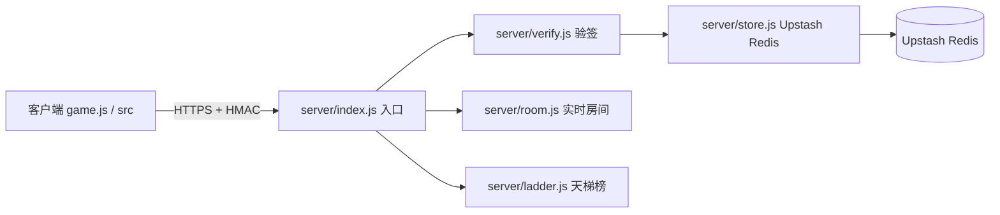

---

## 第五章　异常处理与兼容性

### 5.1 网络失败降级
- 排行榜 / 天梯 / 对战等联网功能请求失败时，**单机核心玩法不受影响**，可继续游戏。
- 分数提交失败时本地缓存，待网络恢复后重试；对战同步超时给出提示并可退出房间。

> 说明：网络异常时在排行榜 / 天梯 / 战绩各列表页内嵌错误提示文案（如"榜单请求失败，请检查网络或后端地址"），并非独立弹窗；沙箱无法在抖音运行时断网截屏，故不配图。

### 5.2 防刷分
- 所有分数提交须经 HMAC-SHA256 签名（`RANK_SECRET`），服务端复核；签名不符或无签名直接拒绝。
- 对异常高频提交、明显超量程分数做过滤与限流，保障榜单公平。

### 5.3 兼容性与适配
- 适配 iOS / Android 抖音客户端；兼容刘海屏 / 挖孔屏安全区。
- 加载图禁显示进度条、禁非真实数据，符合平台自审规范。
- 包体整体 ≤ 20 MB（主包 ≤ 4 MB），满足抖音小游戏包体上限。

---

## 第六章　版本与版权声明

- 软件名称《合成能量》V1.0，代码、美术、名称归属运营者（著作权人）所有。
- 遵守抖音开放平台规范与《计算机软件保护条例》；第三方 SDK / 接口使用符合各自条款。
- 本说明书为软著申请配套材料，功能描述与提交源码（前后各 30 页）一致。

---

## 附 A：截图文件 → 章节映射表

| 截图文件 | 对应章节 | 内容说明 |
| --- | --- | --- |
| `./screenshots/start-page.png` | 第一章、第三章 3.1 | 启动/主界面，含"开始游戏"与"隐私政策"入口 |
| `./screenshots/fresh-board.png` | 第一章 1.1、第三章 3.1 | 初始空棋盘界面，分数 0，两个初始方块(2) |
| `./screenshots/privacy-popup.png` | 第二章、第三章 3.6 | 首次运行隐私政策弹窗 |
| `./screenshots/privacy-full-text.png` | 第三章 3.6 | 隐私政策要点正文弹窗（完整文本） |
| `./screenshots/main-board.png` | 第一章、第三章 3.1、3.2 | 4×4 棋盘核心玩法界面，含震动开关入口 |
| `./screenshots/game-over-696.png` | 第三章 3.3 | 游戏结束结算页：得分 696、排名第 8 位、"再来一局" |
| `./screenshots/global-rank.png` | 第三章 3.4 | 全球排行榜（已修复） |
| `./screenshots/ladder-history.png` | 第三章 3.4 | 天梯综练榜：合战大师(浩然) 696:1611 胜+85 |
| `./screenshots/room-entry.png` | 第三章 3.5 | 好友对战·房间入口 |
| `./screenshots/room-created.png` | 第三章 3.5 | 房间已创建（房间号 M6C6KX） |
| `./screenshots/room-join.png` | 第三章 3.5 | 输入房码加入 |
| `./screenshots/room-battle-result.png` | 第三章 3.5 | 房间对战结算："胜利!"、分数+65 |

> 完整来源文件、缺失清单及候选池说明见 `./screenshots/mapping.md`。

---

## 附 B：缺失截图清单

> ✅ **说明**：本说明书已嵌入 **12 张**《合成能量》真实运行截图（见附图 A），覆盖全部核心功能章节，**无缺失项**。原候选清单中的三项经代码核验已确认非缺失，说明如下：
> - **抖音内搜索 / 扫码进入**：属抖音平台层功能（平台搜索 / 扫码进入），并非游戏内界面，不属游戏功能，故不列为缺失；
> - **独立设置页**：游戏无独立设置页，震动开关为棋盘正下方的嵌入式按钮，已体现在 `main-board.png` / `fresh-board.png` 主界面截图，故不列为缺失；
> - **弱网 / 超时提示**：网络异常时在各列表页（排行榜 / 天梯 / 战绩）内嵌错误提示文案（如"榜单请求失败，请检查网络或后端地址"），并非独立弹窗（详见第五章 5.1），沙箱无法断网截屏，故不配图、不列为缺失。

<!-- pagebreak -->

## 附 C：文档修订记录

| 版本 | 日期 | 修订内容 | 修订人 |
| --- | --- | --- | --- |
| V1.0 | 2026-07-26 | 初稿完成：依据 git HEAD `9d6af64` 撰写全部章节，嵌入 7 张 2026-07-26 抖音开发者工具 iPhone 15 Pro 模拟器真实运行截图，替换原占位符 | 工程师 |
| V1.1 | 2026-07-26 | 补充 5 张新截图（结束结算页、房间对战结算、天梯综练榜、初始空棋盘、隐私政策正文），总计 **12 张**真实运行截图；更新映射表与缺失清单（剩余 3 项非核心辅助场景） | 主理人（用户补图后编排） |
| V1.2 | 2026-07-26 | 准确性修订：移除非游戏功能的搜索进入页与独立设置页两条缺失项，弱网提示改为列表页内嵌错误文案真实形态，图文与实物一致 | 工程师 |

> 说明：本说明书随软件版本同步更新；若后续补充缺失截图或调整功能描述，应在此表中追加修订记录。
