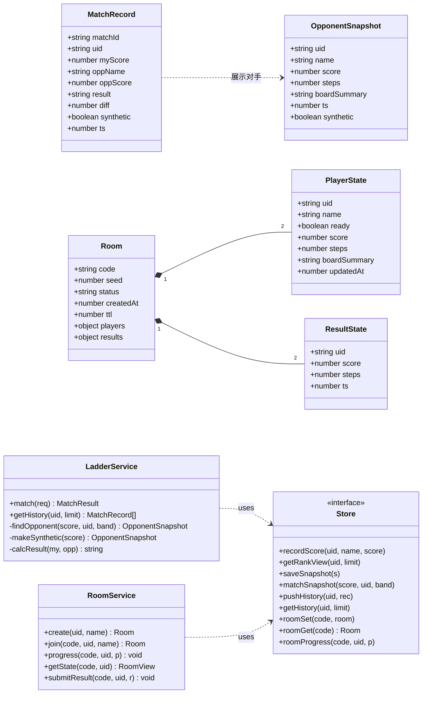
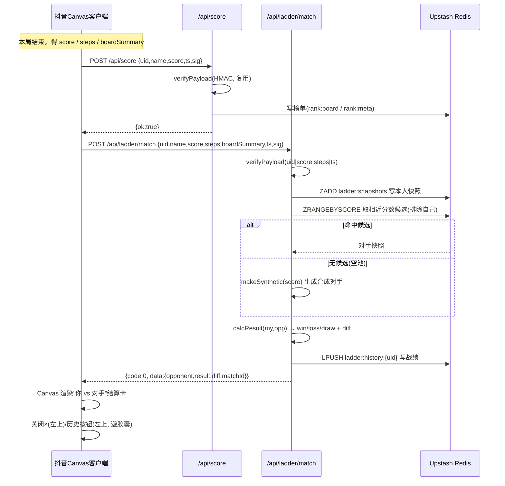
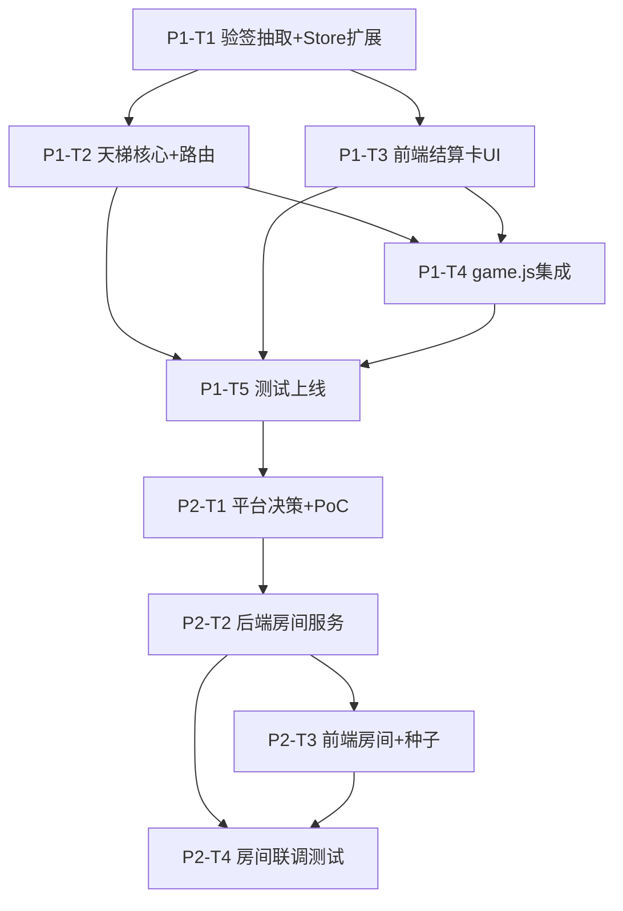

# 合成能量 · 多人对战 / 比赛模式 — 系统架构设计 + 任务分解

> 作者：高见远（架构师） · 文档类型：架构设计 + 任务分解（交付工程师）
> 范围：基于增量 PRD 的「异步天梯（Phase 1）」与「实时房间（Phase 2）」整体架构
> 约束基线：**不改动现有 HMAC 签名协议**、`/api/score`、`/api/rank` 既有行为；Phase 1 纯靠现有 Vercel + Upstash 完成；Phase 2 不引入新托管平台。

---

## 0. 总览与分期策略

| 阶段 | 模式 | 核心机制 | 传输 | 新平台 | 交付节奏 |
|------|------|----------|------|--------|----------|
| **Phase 1** | 异步天梯 | 局后按本局 score 自动匹配**历史快照对手**，结算"你 vs 对手" | 纯 REST（复用 /api/score 签名） | **无** | **本周独立交付** |
| **Phase 2** | 实时房间 | 6 位码建房/加入，同房同种子开局，实时比分 | **Upstash Redis 状态总线 + 前端轮询/SSE**（不使用 Vercel 常驻 WS） | **无** | Phase 1 上线后启动 |

> ⚠️ **Vercel 不支持常驻 WebSocket**：Vercel serverless（含 Node 函数）是无状态请求/响应模型，函数有最大执行时长（Hobby 10s / Pro 默认 60s，最长 300s），**无法承载 tt.connectSocket 所需的持久双向连接**。因此 Phase 2 采用「Redis 作状态总线 + REST 轮询/SSE」替代 WS，既保真实时体验，又**零新托管**（详见 §1.3）。

### Phase 1 交付边界（工程师本周可独立交付）

**包含（IN）：**
1. 后端 `server/verify.js`（抽取现有 `verifyPayload`，行为完全不变）
2. 后端 `server/store.js` 扩展：天梯快照池（ZSET）+ 天梯历史（LIST），Upstash 与 memory 全实现
3. 后端 `server/ladder.js` + `server/index.js` 新增路由 `POST /api/ladder/match`、`GET /api/ladder/history`
4. 前端 `src/ladder.js`：天梯客户端 + Canvas "你 vs 对手"结算卡 + 历史面板
5. 前端 `game.js` 集成：局后触发天梯流程、入口按钮（避开右上系统胶囊，置左上）、返回键双形态兼容
6. 测试：`test/ladder.test.js` + 路由集成测，**保持现有全部测试通过**

**不包含（OUT，属 Phase 2 或非目标）：**
- 任何 WebSocket / 常驻连接、房间码、种子开局、实时进度同步
- 新托管平台、新 npm 依赖
- 排行榜（`/api/score`、`/api/rank`）行为变更

---

## 1. 实现方案 + 框架选型

### 1.1 后端扩展（Phase 1）— 纯增量化，不破坏既有

- **入口不变**：所有 `/api/*` 仍由 `server/index.js` 单一 HTTP 服务分发（现有 `http.createServer` 模式）。新增路由仅在 `req.url` 分支里追加，不影响 `/api/score`、`/api/rank`。
- **验签抽取（关键）**：现有 `verifyPayload(payload, ts, sig)` 内联在 `index.js`。将其**原样**抽到 `server/verify.js` 并导出，`index.js` / `ladder.js` / `room.js` 统一引用。**逐字保留** `secret 为空→开发跳过`、`时间窗 Math.abs(now - t) > SIGN_TTL`、HMAC-SHA256 + `timingSafeEqual` 逻辑，确保既有验签行为零变化。
- **天梯匹配 + 快照 + 结算** → 新模块 `server/ladder.js`：
  - 复用现有 `store` 实例，新增 `saveSnapshot / matchSnapshot / pushHistory / getHistory` 方法（见 §3、§2）。
  - 匹配算法：以本局 `score` 为中心、带宽 `band` 在快照池 `ZRANGEBYSCORE` 取候选，排除本人与近期已匹配 uid，随机取一；**无候选时降级为「合成对手」**（server 生成 `synthetic:true`，保证空池也能玩）。
  - 结算：服务端用**已签名的本局 score** 与对手 `score` 比较，得出 `win/loss/draw` 与 `diff`（对手分数来自可信快照池，无法被客户端伪造）。
- **存储扩展**：在 `server/store.js` 的 `makeStore` 返回对象上追加天梯方法；三种后端（memory / file / upstash）各自实现：
  - `upstash`：快照 `ZADD ladder:snapshots <score> <uid:ts>` + `HSET ladder:snap <uid:ts> <json>`；历史 `LPUSH ladder:history:<uid>` + `LTRIM` 裁剪。复用现有 `rcmd()`（raw fetch 调 Upstash REST，**零 SDK**）。
  - `memory`：数组 + Map 实现（测试/本地）。
  - `file`：JSON 落盘（best-effort，生产用 upstash）。

### 1.2 前端挂载（Phase 1）— 零依赖 Canvas，复用现有模式

- 现有 `game.js` 在 `state.over` 处调用 `submitScore(state.score)` 并 `showBanner()`。Phase 1 在其后追加 `submitLadder(state)`。
- 新增 `src/ladder.js`：封装 `signLadder()`（复用 `HMAC.hmacSha256Hex`，canonical = `uid|score|steps|ts`）、`fetchLadderMatch()`、`fetchLadderHistory()`，以及 Canvas 绘制"你 vs 对手"结算卡与历史面板。
- UI 约定（与现状一致）：所有自定义按钮**避开右上角系统胶囊**——关闭 `×` 与「天梯历史」入口均置于**左上角**；结算卡为全屏 Canvas 覆盖层，复用现有返回键双形态兼容（`enableBackPressed`/`onBackPressed`）。

### 1.3 Phase 2 实时房间 — WebSocket 约束与替代方案（关键）

| 方案 | 可行性 | 新平台 | 实时性 | 推荐度 |
|------|--------|--------|--------|--------|
| **A. Upstash Redis 状态总线 + 前端轮询（1.5s）** | ✅ Vercel 原生支持 | 无 | ~1.5s（2048 足够） | ⭐⭐⭐⭐⭐ **主选** |
| B. Upstash Redis + SSE（GET 流式） | ⚠️ 需 `maxDuration` 配置，长连接受限 | 无 | <1s | ⭐⭐⭐（可选升级） |
| C. `tt.connectSocket` → 外部 WS 主机（Railway/Render/Fly） | ✅ 真双向 | **需新托管** | 真·实时 | ❌ 违反"零新平台" |

**结论（强烈推荐 A）：**
- 房间状态（seed、双方分数/步数/棋盘摘要、结果）全部存 Upstash Redis（带 TTL）。
- 客户端用 `POST /api/room/progress` 上报、用 `GET /api/room/state` **短轮询**（默认 1500ms）拉取对手进度；达标或计时到点后用 `POST /api/room/result` 提交，服务端双方结果齐后定胜负，客户端轮询到 `matchResult`。
- **公平性**：建房时服务端生成随机 `seed`，双方用**同一 seed** 开局（需在 `src/logic.js` 引入 seeded PRNG，使发牌确定化）。这是"同房同随机种子"的落地方式，与是否用 WS 无关。
- 2048 是离散落子、单局短（分钟级），1.5s 轮询完全体感流畅，无需 sub-second 延迟。

### 1.4 技术选型表

| 层 | Phase 1 | Phase 2 | 说明 |
|----|---------|---------|------|
| 前端框架 | 原生 tt + Canvas（零依赖） | 同 | 不引入框架 |
| 前端网络 | `tt.request` REST | `tt.request` REST + 轮询 | 不用 `tt.connectSocket`（避免新平台） |
| 后端 | Vercel serverless（Node http） | 同 | 单入口 `index.js` |
| 存储 | Upstash Redis REST（raw fetch，零 SDK） | 同（作状态总线） | 复用现有凭据 |
| 签名 | HMAC-SHA256，复用 `RANK_SECRET` | 同 | 协议不变 |
| 新增 npm 依赖 | **无** | **无** | 均复用现有能力 |

---

## 2. 文件列表及相对路径

> 路径相对仓库根 `douyin-merge-game/`。`[P1]`=Phase 1，`[P2]`=Phase 2，`(改)`=修改，`(新)`=新增。

### 前端
| 路径 | 动作 | 说明 |
|------|------|------|
| `config.js` | (改) [P1] | 由 `RANK_ENDPOINT` 派生 `LADDER_MATCH_PATH`/`LADDER_HISTORY_PATH`；[P2] 加 `ROOM_*` 路径。`RANK_SECRET` 复用签名。 |
| `src/ladder.js` | (新) [P1] | 天梯客户端（sign/fetch）+ Canvas 结算卡 + 历史面板。 |
| `src/room.js` | (新) [P2] | 房间大厅 UI + 轮询进度 + 结算渲染。 |
| `src/logic.js` | (改) [P2] | 引入 seeded PRNG（`mulberry32` 等），发牌由 `seed` 决定，支撑同房同种子。 |
| `src/hmac.js` | 不变 | 客户端 HMAC（已具备 `hmacSha256Hex`）。 |
| `game.js` | (改) [P1] | 局后触发 `submitLadder`；新增天梯入口按钮（左上）；返回键兼容。(改) [P2] 房间入口 + 用 seed 开局。 |

### 后端
| 路径 | 动作 | 说明 |
|------|------|------|
| `server/verify.js` | (新) [P1] | 从 `index.js` **原样抽取** `verifyPayload`（行为不变），供 score/ladder/room 共用。 |
| `server/ladder.js` | (新) [P1] | `LadderService`：匹配/快照/结算/历史。 |
| `server/room.js` | (新) [P2] | `RoomService`：create/join/progress/state/result。 |
| `server/store.js` | (改) [P1][P2] | 扩展 `makeStore`：天梯方法（P1）+ 房间方法（P2）；三后端实现。 |
| `server/index.js` | (改) [P1][P2] | 改 `verifyPayload` 为引用 `verify.js`；新增 `/api/ladder/*`（P1）、`/api/room/*`（P2）路由分支。 |
| `server/vercel.json` | (改) [P2?] | P1 无需改；若 P2 选 SSE 需配 `maxDuration`，否则不动。 |

### 测试
| 路径 | 动作 | 说明 |
|------|------|------|
| `test/ladder.test.js` | (新) [P1] | 验签复用、匹配、合成对手降级、历史读写。 |
| `test/room.test.js` | (新) [P2] | 建房/加入/进度/结算/轮询。 |
| `test/server.test.js` 等 | 不变 | 既有测试必须保持通过（回归护栏）。 |

---

## 3. 数据结构和接口

### 3.1 类图（Mermaid）



### 3.2 接口契约（JSON Schema）

#### 3.2.1 天梯（Phase 1）

**POST `/api/ladder/match`** — 提交本局并匹配对手，返回胜负
```jsonc
// Request body（写入接口，需签名）
{
  "uid": "u_abc123",          // 玩家 uid
  "name": "玩家昵称",          // 展示名（≤16 字）
  "score": 1234,              // 本局分数（已受 RANK_MAX_SCORE 校验）
  "steps": 87,                // 本局步数
  "boardSummary": "2,4,8,...,2048,0,0", // 16 格棋盘摘要（逗号分隔），仅用于结算展示
  "ts": 1690000000,           // 秒级 Unix 时间戳（与现有 /api/score 一致）
  "sig": "hmac_hex"           // HMAC-SHA256(RANK_SECRET, "uid|score|steps|ts")
}
// Response（新接口采用 {code,data,message} 信封；既有 /api/score、/api/rank 不变）
{
  "code": 0,
  "message": "ok",
  "data": {
    "matchId": "m_1690000000_x7f3",
    "myScore": 1234,
    "opponent": {
      "name": "对手昵称",
      "score": 1180,
      "steps": 91,
      "boardSummary": "2,4,...,1024,0,0",
      "synthetic": false
    },
    "result": "win",          // win | loss | draw
    "diff": 54,               // myScore - oppScore
    "synthetic": false
  }
}
```

**GET `/api/ladder/history?uid=...&limit=20&ts=...&sig=...`** — 天梯历史（读取接口，需签名，与现有 `/api/rank` 一致）
```jsonc
// Response
{
  "code": 0,
  "message": "ok",
  "data": {
    "list": [
      { "matchId":"m_...", "myScore":1234, "oppName":"对手", "oppScore":1180,
        "result":"win", "diff":54, "synthetic":false, "ts":1690000000 }
      // ... 按 ts 倒序
    ],
    "total": 23
  }
}
```

#### 3.2.2 房间（Phase 2，逻辑 WS 协议 → 落地为 REST）

| 逻辑 WS 消息 | 落地 REST（替代 WS） | 方向 |
|--------------|----------------------|------|
| `create` | `POST /api/room/create {uid,name,ts,sig}` → `{code,seed,status}` | C→S |
| `join` | `POST /api/room/join {code,uid,name,ts,sig}` → `{seed,players,status}` | C→S |
| `seed` | 由 `create`/`join` 响应返回 | S→C |
| `progress` | `POST /api/room/progress {code,uid,ts,sig,score,steps,boardSummary}` → `{ok:true}` | C→S |
| `opponent_progress` | `GET /api/room/state?code=&uid=&ts=&sig=` → `{opponent:{score,steps,boardSummary,updatedAt}}` | S→C（轮询） |
| `result` | `POST /api/room/result {code,uid,ts,sig,score,steps}` → `{ok:true}` | C→S |
| `match_result` | 轮询 `GET /api/room/state` 返回 `{matchResult:"win|loss|draw", myScore, oppScore}` | S→C（轮询） |

**Room 状态（存 Redis，TTL 600s）**
```jsonc
{
  "code": "A1B2C3",
  "seed": 123456789,          // 同房同种子，双方开局一致
  "status": "waiting|playing|finished",
  "createdAt": 1690000000000,
  "ttl": 600,
  "players": {
    "u_p1": { "uid":"u_p1", "name":"P1", "ready":true, "score":0, "steps":0, "boardSummary":"", "updatedAt":0 },
    "u_p2": { "uid":"u_p2", "name":"P2", "ready":true, "score":0, "steps":0, "boardSummary":"", "updatedAt":0 }
  },
  "results": {
    "u_p1": { "uid":"u_p1", "score":2048, "steps":120, "ts":1690000060000 }
    // u_p2 提交后补全，双方齐 → 计算 matchResult
  }
}
```

---

## 4. 程序调用流程（时序图）

> 完整 Mermaid 另存于 `docs/sequence-diagram.mermaid`（含两阶段）。

### 4.1 Phase 1 天梯一局流程



### 4.2 Phase 2 房间对战流程（Upstash + 轮询，替代 WS）

```mermaid
sequenceDiagram
    participant P1 as 玩家1(抖音)
    participant P2 as 玩家2(抖音)
    participant API as Vercel /api/room/*
    participant DB as Upstash Redis(状态总线)

    P1->>API: POST /api/room/create {uid,name,sig}
    API->>DB: 建房间(code, seed, TTL=600s)
    API-->>P1: {code:"A1B2C3", seed}

    P2->>API: POST /api/room/join {code,uid,name,sig}
    API->>DB: 加入房间(上限2), 分配相同 seed
    API-->>P2: {seed, players}

    P1->>P1: 用 seed 开局(同房同随机种子)
    P2->>P2: 用 seed 开局

    loop 每步/定时(轮询约1.5s)
        P1->>API: POST /api/room/progress {score,steps,summary}
        API->>DB: HSET room:{code} player:p1
        P1->>API: GET /api/room/state (轮询)
        API->>DB: 读对手进度
        API-->>P1: {opponent:{score,steps}}
        P2 同理(对称)
    end

    P1->>API: POST /api/room/result {score,steps}
    P2->>API: POST /api/room/result {score,steps}
    API->>DB: 双方结果齐 → 计算胜负, 写 results
    P1->>API: GET /api/room/state (轮询)
    API-->>P1: {matchResult:win/loss/draw}
    P1->>P1: Canvas 渲染房间结算
```

---

## 5. 任务列表（分阶段、有序、含依赖）

> 说明：本任务是**既有项目增量功能**，无"项目基础设施"任务（基础设施已存在），且用户要求分阶段呈现，故任务数按阶段展开（Phase 1 含 5 个分组任务）。所有任务均可在不引入新平台/新依赖下完成。

### 5.1 Phase 1 任务（工程师本周可独立交付）

| ID | 任务 | 源文件 | 依赖 | 优先级 |
|----|------|--------|------|--------|
| **P1-T1** | **共享验签抽取 + Store 天梯扩展**：`verify.js` 原样抽取 `verifyPayload`；`store.js` 在 `makeStore` 与 memory/upstash 后端实现 `saveSnapshot/matchSnapshot/pushHistory/getHistory`（file 后端 best-effort）。 | `server/verify.js`(新), `server/store.js`(改), `server/index.js`(改：引用 verify.js) | 无 | P0 |
| **P1-T2** | **后端天梯核心**：`ladder.js` 实现匹配（ZRANGEBYSCORE + 排除本人/近期对手 + 合成对手降级）、结算（服务端算 win/loss/draw + diff）、历史；`index.js` 新增 `POST /api/ladder/match`、`GET /api/ladder/history` 路由（签名复用）。 | `server/ladder.js`(新), `server/index.js`(改) | P1-T1 | P0 |
| **P1-T3** | **前端天梯客户端 + 结算卡 UI + 历史面板**：`src/ladder.js` 封装 `signLadder`/`fetchLadderMatch`/`fetchLadderHistory` 与 Canvas "你 vs 对手"结算卡、历史列表；`config.js` 派生路径。可用 mock 先行并行开发。 | `src/ladder.js`(新), `config.js`(改) | P1-T2（联调） | P0 |
| **P1-T4** | **game.js 集成挂载**：局后 `state.over` 调 `submitLadder`；新增天梯入口按钮（左上，避胶囊）；结算卡返回键双形态兼容。 | `game.js`(改) | P1-T3 | P0 |
| **P1-T5** | **测试与上线校验**：`test/ladder.test.js`（验签复用、匹配、合成降级、历史）；`server` 路由集成测；**确保 `test/*.test.js` 全部通过**（回归护栏）。 | `test/ladder.test.js`(新) | P1-T2, P1-T3, P1-T4 | P0 |

### 5.2 Phase 2 任务（依赖 Phase 1 + 平台决策先决）

| ID | 任务 | 源文件 | 依赖 | 优先级 |
|----|------|--------|------|--------|
| **P2-T1** | **平台决策 + 方案验证**：确认采用「Upstash Redis 状态总线 + 轮询（默认 1500ms）/SSE」；产出 PoC 验证房间状态读写与轮询延迟。输出最终传输选型决策。 | `docs/`（决策记录）, `server/room.js`(骨架) | Phase 1 完成 | P1 |
| **P2-T2** | **后端房间服务**：`room.js` 实现 create/join/progress/state/result；`store.js` 扩展房间方法（Redis 带 TTL）；`index.js` 新增 `/api/room/*` 路由。 | `server/room.js`(新), `server/store.js`(改), `server/index.js`(改) | P2-T1 | P1 |
| **P2-T3** | **前端房间**：`src/room.js` 大厅 UI + 轮询进度 + 结算；`src/logic.js` 引入 seeded PRNG 使同房同种子开局；`game.js` 房间入口与 seed 开局接入。 | `src/room.js`(新), `src/logic.js`(改), `game.js`(改) | P2-T2 | P1 |
| **P2-T4** | **房间联调 + 测试**：`test/room.test.js`（建房/加入/进度/结算/轮询）；双端模拟对战验收。 | `test/room.test.js`(新) | P2-T2, P2-T3 | P1 |

### 5.3 任务依赖图（Mermaid）



---

## 6. 依赖包列表

| 包 / 模块 | 用途 | 阶段 | 是否新增 |
|-----------|------|------|----------|
| `@upstash/redis` / Upstash REST | 排行榜 + 天梯 + 房间状态总线（现有用 raw `fetch` 调 REST，**无 SDK 依赖**） | P1/P2 | **否（复用现有凭据与模式）** |
| Node `crypto` / `http` | 服务端验签与 HTTP 服务（内置） | P1/P2 | 否 |
| `src/hmac.js` | 客户端 HMAC（已具备 `hmacSha256Hex`） | P1/P2 | 否 |
| **新增 npm 依赖** | —— | —— | **无（两阶段均零新依赖）** |

> 结论：Phase 1 与 Phase 2 均**不引入任何新 npm 包**。若 P2 选 SSE，仍用内置 `http` 流式，无需新依赖；若坚持 `tt.connectSocket`，则需外部 WS 平台（违反"零新平台"约束，不推荐）。

---

## 7. 共享知识（跨文件约定）

- **字段命名**：`snake_case`（与现有 `{uid,name,score,ts,sig}` 一致）。
- **时间格式**：`ts` 统一为**秒级** Unix 时间戳（与现有 `verifyPayload` 的 `now = floor(Date.now()/1000)` 一致；注意不是毫秒）。
- **签名协议（延续，禁止改）**：
  - 算法 HMAC-SHA256，密钥 `RANK_SECRET`（前后端一致）。
  - canonical 用 `|` 拼接；现有 score=`uid|score|ts`，新增 ladder=`uid|score|steps|ts`，room=`uid|score|steps|ts`（按需）。
  - 验证窗口 `SIGN_TTL`（默认 300s）防重放；`secret` 为空=开发模式跳过（仅本地）。
  - 服务端用请求体字段**重新拼接** canonical 再验，绝不信任客户端传入的 canonical 字符串。
- **错误码信封（仅新接口）**：统一 `{code, data, message}`；`code:0`=成功，`1`=参数错误，`2`=签名/重放失效，`3`=未找到(房间/对手)，`4`=频率限制，`5`=服务端错误。**既有 `/api/score`、`/api/rank` 保持原有 `{ok, error}` 形态不变。**
- **读取接口签名**：`/api/rank`、`/api/ladder/history`、`/api/room/state` 均要求 `sig`（与现有 rank 一致）；写入接口要求 `sig`。
- **分数范围**：复用 `RANK_MAX_SCORE` 校验（默认 10,000,000）。
- **CORS**：现有已设 `Access-Control-Allow-Origin: *`，新路由沿用。
- **存储键约定**：天梯快照 `ladder:snapshots`(ZSET) + `ladder:snap`(HASH)；历史 `ladder:history:<uid>`(LIST)；房间 `room:<code>`(HASH/JSON, TTL 600s)。

---

## 8. 待明确事项（含推荐默认值，盼 PM 拍板）

| # | 待确认点 | 推荐默认值 | 影响 |
|---|----------|-----------|------|
| 1 | 天梯匹配带宽 `band` 与去重 | `band = ±15% 且最小 ±50 分`；空池/无候选→合成对手；**24h 内不与同一对手重复**（`lastOppUid` 排除） | 匹配体验、冷启动 |
| 2 | 天梯历史保留 | 最近 **50 条 / 30 天**（`LTRIM` + 写时裁剪） | 存储、历史面板 |
| 3 | Phase 2 结算规则 | **先合成出 2048 即胜，或 180s 到时比分高者胜，平分则平局** | 房间胜负逻辑 |
| 4 | 房间人数 | 固定 **2 人**（PRD"双方"）；暂不支持观战 | 房间模型 |
| 5 | 房间码 TTL 与重连 | `TTL=600s`；断线可用 `code` + `uid` 重连（progress/state 按 uid 识别） | 房间生命周期 |
| 6 | 轮询频率 | **1500ms**（2048 单局短，流量可接受）；SSE 作为可选升级 | 实时性/流量 |
| 7 | Phase 2 传输选型 | **Upstash Redis 状态总线 + 轮询/SSE（零新平台）**；`tt.connectSocket` 需新托管，不推荐 | 架构基线（约束） |
| 8 | `/api/score` 与 `/api/ladder/match` 关系 | 局后**先调 `/api/score`（入榜，原行为不变），再调 `/api/ladder/match`（天梯，不重复入榜）** | 调用顺序、去重 |

> 以上 1–6 为体验参数，可在 Phase 1/2 开发中以推荐值先行，后续由 PM 调参；**第 7 条为架构硬约束，强烈建议按推荐值确定**，以免引入新托管平台。
</content>
</invoke>
